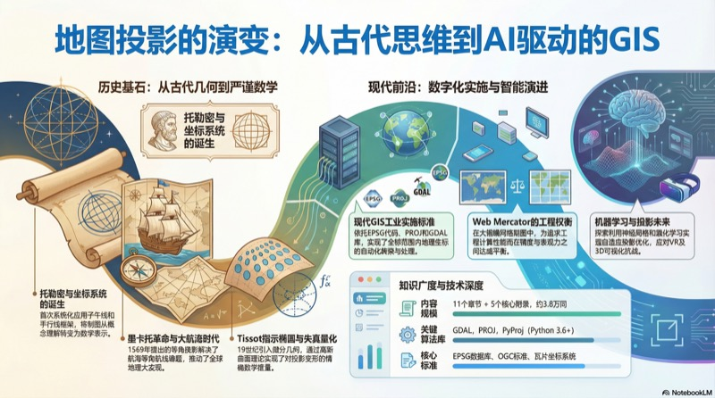

# The Evolution and Theory of Map Projections

> **地图投影的演变与理论 - 从古代到现代GIS的专业参考书**

## 简介 (Introduction)



本书系统地阐述了地图投影的历史演变、数学理论和现代实现。从古代制图的概念起点开始，深入探讨了数学制图的发展历程，涵盖从基本几何投影到现代GIS工具中复杂投影方法的各个方面。特别强调了GDAL、PROJ等开源GIS工具的实际应用。

全书以历史演进的叙述为主线，结合严谨的数学推导，为GIS专业人士提供了一本全面的参考书。每章都既包含历史背景和故事，又有详细的数学公式和技术讨论，确保读者既能理解投影的发展脉络，又能掌握实际应用的数学方法。

## 目标读者 (Target Audience)

- GIS 专业人士
- 地理信息系统、遥感和空间数据分析领域的研究人员
- 开发者和工程师
- 制图学和大地测量学相关专业师生

## 书籍特色 (Key Features)

1. **详细的历史叙述**：从古代文明到现代计算技术，完整呈现地图投影的发展历程
2. **严谨的数学推导**：所有关键公式均有完整推导，使用LaTeX格式
3. **现代技术融合**：详细讲解GDAL、PROJ库在现代GIS中的应用
4. **专业术语规范**：中英文术语对照，便于专业交流
5. **丰富的代码示例**：包含Python代码示例和实践工具
6. **理论与实践结合**：每章结尾连接历史发展与现代实践

**统计信息：**
- 总字数：约38,842词
- 章节数：11章 + 5个附录
- 文件格式：Markdown，支持LaTeX公式渲染
- 语言：中文叙述（专业术语保留英文）

## 章节目录 (Table of Contents)

### 第一部分：从古代概念到数学制图 (Part I: From Ancient Concepts to Mathematical Cartography)

#### 第1章：从古代概念到数学制图 (Chapter 1: From Ancient Concepts to Mathematical Cartography)
- [阅读章节](chapter-01.md)
- 古代文明的地图制作（巴比伦、埃及、中国）
- 古希腊对天体和大地测量的贡献（米利都学派、毕达哥拉斯球形地球）
- ⭐ **埃拉托斯特尼的地球周长计算**（完整数学推导）
- 从概念理解到数学表示的转变
- 早期球面到平面的简单变换：$x = R \cdot \lambda, y = R \cdot \phi$

#### 第2章：托勒密与数学制图的诞生 (Chapter 2: Ptolemy and the Birth of Mathematical Cartography)
- [阅读章节](chapter-02.md)
- 托勒密的双重投影及其革命性
- 子午线和平行线作为数学框架的首次使用
- 托勒密方法在中世纪的传播
- 坐标系统（coordinate system）的首次系统化应用

### 第二部分：大航海时代与数学创新 (Part II: Age of Exploration and Mathematical Innovation)

#### 第3章：墨卡托革命与大航海时代 (Chapter 3: The Mercator Revolution and the Age of Discovery)
- [阅读章节](chapter-03.md)
- ⭐ **1569年墨卡托投影的详细数学推导**
- 等角航线（rhumb line）理论的发展
- 航海问题的数学本质
- 对航海革命的推动作用

**核心公式：**
$$
x = R \cdot \lambda
$$
$$
y = R \ln\left[\tan\left(\frac{\pi}{4} + \frac{\phi}{2}\right)\right]
$$

#### 第4章：制图的数学文艺复兴 (Chapter 4: The Mathematical Renaissance in Cartography)
- [阅读章节](chapter-04.md)
- 17-18世纪的微积分与解析几何发展
- 拉格朗日、欧拉、兰伯特的贡献
- 等角投影理论的严格数学基础
- 系统性失真分析的量化方法

### 第三部分：19世纪 - 制图成为科学 (Part III: 19th Century - Cartography Becomes Scientific)

#### 第5章：19世纪的数学进步 (Chapter 5: Mathematical Advances of the 19th Century)
- [阅读章节](chapter-05.md)
- ⭐ **高斯的曲面理论和高斯绝妙定理（Theorema Egregium）**
- **Tissot指示椭圆的发展和失真量化**
- ⭐ 微分几何在制图中的应用（详细数学分析）
- 失真度量和定量投影分析

**Tissot指示椭圆参数：**
$$
a = \sqrt{\left( \frac{\partial x}{\partial \lambda} \right)^2 + \left( \frac{\partial y}{\partial \lambda} \right)^2} \cdot \frac{1}{R \cos \phi}}
$$
$$
b = \sqrt{\left( \frac{\partial x}{\partial \phi} \right)^2 + \left( \frac{\partial y}{\partial \phi} \right)^2} \cdot \frac{1}{R}}
$$

#### 第6章：国家测绘系统与实际需求 (Chapter 6: National Mapping Systems and Practical Requirements)
- [阅读章节](chapter-06.md)
- 国家坐标系的发展（Gauss-Krüger投影）
- 州平面坐标系（State Plane coordinate systems）
- 大规模测绘的实际数学
- **横轴墨卡托推导和应用**（包含公式和案例）

### 第四部分：数字革命 - 计算制图 (Part IV: Digital Revolution - Computational Cartography)

#### 第7章：早期计算机制图 (Chapter 7: Early Computer-Based Cartography)
- [阅读章节](chapter-07.md)
- 早期计算机大地测量和算法
- 标准化投影库的开发（PROJ库）
- 计算实施中的独特挑战和解决方案
- 复杂投影的数值近似方法

#### 第8章：现代误差分析与质量度量 (Chapter 8: Modern Error Analysis and Quality Measurement)
- [阅读章节](chapter-08.md)
- 定量失真指标和误差评估
- ⭐ **机器学习在投影优化中的应用**（神经网络优化、强化学习）
- 现代数学技术在经典投影中的应用
- 小波分析、信息论指标
- Python代码示例

### 第五部分：当代实施与标准 (Part V: Contemporary Implementation and Standards)

#### 第9章：现代GIS软件中的实施 (Chapter 9: Implementation in Contemporary GIS Software)
- [阅读章节](chapter-09.md) ⭐ **实用技术重点章节**
- ⭐ **GDAL、PROJ库的全面功能**
- EPSG代码和坐标权威系统
- 现代软件实施中的实际问题
- **完整的代码示例和使用模式**

**代码示例：**
```python
import pyproj

# 坐标转换示例
crs_from = pyproj.CRS('EPSG:4326')  # WGS84
crs_to = pyproj.CRS('EPSG:3857')   # Web Mercator
transformer = pyproj.Transformer.from_crs(crs_from, crs_to)

lon, lat = -73.9857, 40.7484  # 纽约市
x, y = transformer.transform(lon, lat)

print(f"经纬度: ({lon}, {lat})")
print(f"Web Mercator: ({x:.2f}, {y:.2f})")
```

#### 第10章：网络制图和新的标准化 (Chapter 10: Web Mapping and the New Standardization)
- [阅读章节](chapter-10.md)
- **Web Mercator: 采用、批评和替代方案**（球形approximation的工程权衡分析）
- Google Maps对制图标准的影响
- **大规模网络制图中的工程权衡**（性能vs精度）
- 瓦片坐标系统的数学公式

### 第六部分：未来趋势 (Part VI: Future Trends)

#### 第11章：制图投影的未来 (Chapter 11: The Future of Cartographic Projections)
- [阅读章节](chapter-11.md)
- 机器学习和自适应投影
- ⭐ **虚拟现实和3D可视化挑战**
- 新兴数学方法和研究方向
- 神经网络投影变换、强化学习投影优化
- 拓扑数据分析应用

## 附录内容 (Appendices)

### 附录 A：制图创新历史时间线 (Appendix A: Historical Timeline of Key Innovations)
- [查阅附录 A](appendix-a.md)
- 从古代到现代的150+个重要创新事件
- 年份、事件、贡献者的完整表格

### 附录 B：主要贡献者传记笔记 (Appendix B: Biographical Notes on Major Contributors)
- [查阅附录 B](appendix-b.md)
- 托勒密、墨卡托、高斯、蒂索等关键人物的专业传记

### 附录 C：数学推导集合 (Appendix C: Mathematical Derivations Collection)
- [查阅附录 C](appendix-c.md)
- ⭐ **全书所有关键公式的完整数学推导集合**
- 墨卡托投影推导（包含等角条件、微分方程、积分过程）
- 横轴墨卡托与高斯-克吕格投影（椭球面推导）
- Tissot指示椭圆参数计算
- 投影变形的综合度量（Airy、Jordan、Goldberg-Gott指标）

### 附录 D：现代标准和组织参考 (Appendix D: Modern Standards and Organizations Reference)
- [查阅附录 D](appendix-d.md)
- EPSG数据库详解
- OGC标准介绍
- PROJ库文档
- GDAL库文档

### 附录 E：实施参考（GDAL/PROJ示例）(Appendix E: Implementation References (GDAL/PROJ Examples))
- [查阅附录 E](appendix-e.md)
- ⭐ **完整的Python代码示例**
- 命令行工具使用指南
- 4个实际应用案例：
  - Web地图瓦片生成
  - 多源数据融合
  - 大数据批处理
  - 动态投影服务

## 使用说明 (Usage)

### 阅读建议 (Reading Recommendations)

#### 初学者路径
1. 按章节顺序阅读第1-3章，理解历史背景和基础概念
2. 重点阅读第5章（数学基础）和第9章（现代实现）
3. 参考附录E（代码示例）进行实践

#### 实践工作者路径
1. 直接阅读第9章（现代GIS实施）和附录E（代码示例）
2. 根据需要参考第3章（墨卡托）和第5章（Tissot指示椭圆）
3. 使用附录C查找需要的数学公式推导

#### 研究人员路径
1. 深入阅读第4、5、8章的数学内容
2. 探索第11章的前沿研究方向
3. 参考附录C和D的标准和研究资料

### 技术要求 (Technical Requirements)

- **数学基础**：微积分（积分、微分方程）、微分几何基础、线性代数、球面三角学
- **编程基础**：Python 3.6+ 及相关科学计算库（numpy, scipy, matplotlib, pyproj, gdal）
- **阅读工具**：支持LaTeX公式渲染的Markdown查看器（如Typora、Obsidian、GitHub、VS Code）

### 工具推荐 (Recommended Tools)

- **Markdown编辑器**：Typora、Obsidian、VS Code（配合Markdown Preview Enhanced插件）
- **公式渲染**：KaTeX、MathJax
- **代码运行**：Jupyter Notebook、Google Colab、本地Python环境
- **GIS软件**：QGIS、ArcGIS、GRASS GIS（用于验证投影效果）

## 学习路径 (Learning Paths)

### 路径1: 历史与理论专家（9篇）
- 第1章 → 第2章 → 第3章 → 第4章 → 第5章 → 第8章 → 第10章 → 第11章
- 重点：理解投影发展的历史脉络、掌握数学理论基础

### 路径2: 技术实践专家（7篇）
- 第1章 → 第5章 → 第9章 → 附录C → 附录E → 第6章 → 第10章
- 重点：掌握现代GIS工具实现、实际应用项目开发

### 路径3: 快速参考手册（按需查阅）
- 附录C（数学公式）
- 附录E（代码示例）
- 附录D（标准参考）
- 第9章（GIS实施）

## 数学符号说明 (Mathematical Notation)

- $R$: 地球半径
- $\phi$ (phi): 纬度 (latitude)
- $\lambda$ (lambda): 经度 (longitude)
- $x, y$: 平面坐标
- $a, b$: Tissot指示椭圆的半长轴和半短轴
- $\theta$: 方位角或旋转角
- $k$: 比例因子

## 书籍文件 (Book Files)

所有文件均为Markdown格式，位于 `cartographic-projections/` 目录：

```
cartographic-projections/
├── README.md                    # 本文件 - 项目总览
├── INDEX.md                     # 索引文件 - 详细内容大纲
├── LICENSE                      # MIT License
├── chapter-01.md                # 古代到数学制图
├── chapter-02.md                # 托勒密与数学制图诞生
├── chapter-03.md                # 墨卡托革命
├── chapter-04.md                # 数学文艺复兴
├── chapter-05.md                # 19世纪数学进步（高斯、蒂索）
├── chapter-06.md                # 国家测绘系统
├── chapter-07.md                # 早期计算机制图
├── chapter-08.md                # 现代误差分析
├── chapter-09.md                # 现代GIS实施
├── chapter-10.md                # 网络制图
├── chapter-11.md                # 未来趋势
├── appendix-a.md                 # 制图创新历史时间线
├── appendix-b.md                 # 主要贡献者传记
├── appendix-c.md                 # 数学推导集合
├── appendix-d.md                 # 现代标准和组织参考
└── appendix-e.md                 # GDAL/PROJ实现示例
```

## 核心章节亮点 (Chapter Highlights)

### 必读章节（Foundation Chapters）
- ✅ **第3章**：墨卡托投影的完整数学推导，理解等角投影的核心思想
- ✅ **第5章**：高斯曲面理论和蒂索指示椭圆，掌握失真分析的基本方法
- ✅ **第9章**：现代GIS工具实施，GDAL/PROJ的实际应用

### 进阶章节（Advanced Chapters）
- **第8章**：现代数学方法在投影优化中的应用
- **第11章**：未来趋势和前沿研究方向

### 参考章节（Reference Chapters）
- 附录C：全书数学公式推导集合
- 附录E：完整代码示例和实践案例

## 作者与贡献 (Authors and Contributors)

本书是一个协作项目，旨在为GIS专业社区提供高质量的地图投影技术内容。

**主要贡献者：**
- 理论内容：基于经典制图学教科书和学术论文
- 数学推导：几何学、微分几何、大地测量学原理
- 技术实现：GDAL、PROJ、Python生态系统实践
- 历史研究：权威历史文献和学术资料

## 许可信息 (License)

本书采用 MIT License 开源发布。详见 [LICENSE](LICENSE) 文件。

```
MIT License

Copyright (c) 2026 GIS Professional Book Project

Permission is hereby granted, free of charge, to any person obtaining a copy
of this software and associated documentation files (the "Software"), to deal
in the Software without restriction, including without limitation the rights
to use, copy, modify, merge, publish, distribute, sublicense, and/or sell
copies of the Software, and to permit persons to whom the Software is
furnished to do so, subject to the following conditions:

The above copyright notice and this permission notice shall be included in all
copies or substantial portions of the Software.
```

## 版本历史 (Version History)

- **v1.0** (2026-02-25): 初始版本完成
  - 11个正文章节
  - 5个附录
  - 约38,842词

## 贡献指南 (Contributing Guidelines)

欢迎通过以下方式参与：

1. **报告错误**：如果您发现公式错误、拼写问题或内容不准确，请创建issue
2. **建议改进**：提出新的主题建议或内容优化方向
3. **代码贡献**：改进Python代码示例、修复bug、添加新示例
4. **文档完善**：补充历史资料、更新标准信息、扩展参考文献

## 反馈与支持 (Feedback and Support)

如果您对本书有任何问题或建议，欢迎通过以下方式联系：

- 提交GitHub Issue
- 发送邮件反馈
- 参与社区讨论

## 相关资源 (Related Resources)

### 推荐阅读
- Snyder, J. P. (1987). *Map Projections - A Working Manual*. USGS Professional Paper 1395
- Maling, D. H. (1992). *Coordinate Systems and Map Projections*. Pergamon Press
- PROJ. *Coordinate Transformation Software Library*. https://proj.org/
- GDAL. *Geospatial Data Abstraction Library*. https://gdal.org/

### 相关软件
- PROJ: https://proj.org/
- GDAL: https://gdal.org/
- QGIS: https://www.qgis.org/
- PyProj: https://pyproj4.github.io/pyproj/

---

*这本书记录了人类从仰望星空到精确测量地球的智力旅程，从古埃及的泥板到现代计算机上的精密投影。希望它能为GIS专业人士提供有价值的参考。*
