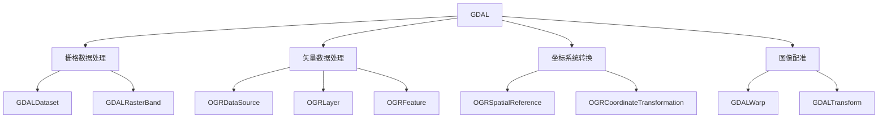
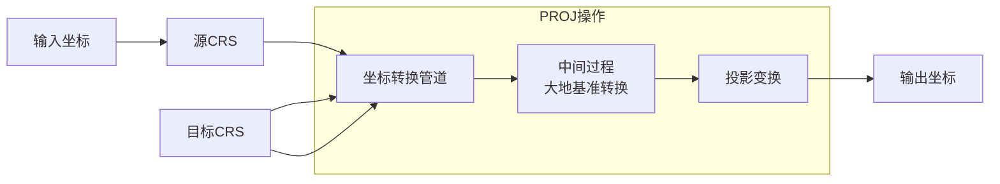

# 第九章 现代GIS软件中的实施

## 9.1 引言

现代地理信息系统（GIS）软件依赖于强大的底层库和标准化的坐标系统来实现地图投影、坐标转换和空间数据处理。GDAL（Geospatial Data Abstraction Library）和PROJ是当今GIS领域最核心的两个开源工具库。GDAL提供了统一的数据抽象层，支持数百种栅格和矢量数据格式；PROJ则是坐标转换和地图投影的事实标准库。

本章将深入探讨现代GIS软件中的投影实施细节，包括：GDAL和PROJ的全面功能，EPSG代码系统和坐标权威标准，实际软件开发中的挑战和解决方案，以及大量实用的代码示例。

理解这些底层工具的工作原理和最佳实践，对于开发高性能的GIS应用、处理复杂的坐标转换问题以及实现精确的地图投影至关重要。

---

## 9.2 GDAL库全面功能

### 9.2.1 GDAL架构概述

GDAL是一个用于读写栅格和矢量地理空间数据格式的转换库。它采用驱动（driver）架构，每种数据格式对应一个驱动程序。

**核心组件：**



### 9.2.2 栅格数据处理

#### 读取和写入栅格数据

GDAL支持多种栅格格式，包括GeoTIFF、JPEG2000、PNG等。

**读取栅格数据：**

```python
from osgeo import gdal
import numpy as np

def read_raster(file_path):
    """
    读取栅格数据文件

    参数：
        file_path: 文件路径

    返回：
        包含栅格数据的字典
    """
    # 打开数据集
    dataset = gdal.Open(file_path, gdal.GA_ReadOnly)

    if dataset is None:
        raise ValueError(f"无法打开文件: {file_path}")

    # 获取基本信息
    info = {
        'driver': dataset.GetDriver().ShortName,
        'width': dataset.RasterXSize,
        'height': dataset.RasterYSize,
        'bands': dataset.RasterCount,
        'projection': dataset.GetProjection(),
        'geotransform': dataset.GetGeoTransform()
    }

    # 读取所有波段数据
    bands_data = []
    for i in range(1, dataset.RasterCount + 1):
        band = dataset.GetRasterBand(i)
        data = band.ReadAsArray()
        nodata = band.GetNoDataValue()
        bands_data.append({
            'band_number': i,
            'data': data,
            'nodata': nodata,
            'data_type': gdal.GetDataTypeName(band.DataType)
        })

    info['bands'] = bands_data

    # 关闭数据集
    dataset = None

    return info

def get_raster_metadata(file_path):
    """
    获取栅格数据的元数据信息
    """
    dataset = gdal.Open(file_path)

    # 地理变换参数
    # (origin_x, pixel_width, rotation,
    #  origin_y, rotation, pixel_height)
    geotransform = dataset.GetGeoTransform()

    # 投影信息
    projection = dataset.GetProjection()

    # 获取OGR空间参考对象
    srs = osr.SpatialReference()
    srs.ImportFromWkt(projection)

    # 转换为PROJ.4格式
    proj4 = srs.ExportToProj4()

    # 获取EPSG代码
    epsg_code = None
    if srs.IsProjected():
        epsg_code = srs.GetAuthorityCode('PROJCS')
    elif srs.IsGeographic():
        epsg_code = srs.GetAuthorityCode('GEOGCS')

    return {
        'geotransform': {
            'origin_x': geotransform[0],
            'origin_y': geotransform[3],
            'pixel_width': geotransform[1],
            'pixel_height': geotransform[5],
            'rotation_x': geotransform[2],
            'rotation_y': geotransform[4]
        },
        'projection_wkt': projection,
        'projection_proj4': proj4,
        'epsg_code': epsg_code,
        'raster_size': {
            'width': dataset.RasterXSize,
            'height': dataset.RasterYSize
        }
    }
```

**写入栅格数据：**

```python
from osgeo import gdal, osr
import numpy as np

def write_raster(output_path, data_array, geotransform, projection,
                driver='GTiff', nodata=None, data_type=gdal.GDT_Float32):
    """
    写入栅格数据

    参数：
        output_path: 输出文件路径
        data_array: 数据数组（可以是多维）
        geotransform: 地理变换参数元组
        projection: 投影信息（WKT格式）
        driver: GDAL驱动类型
        nodata: 无数据值
        data_type: GDAL数据类型
    """
    # 如果数据是二维的，转换为三维
    if len(data_array.shape) == 2:
        data_array = np.expand_dims(data_array, axis=0)

    bands, height, width = data_array.shape

    # 获取驱动
    driver = gdal.GetDriverByName(driver)

    # 创建输出数据集
    dataset = driver.Create(
        output_path,
        width,
        height,
        bands,  # 波段数
        data_type
    )

    if dataset is None:
        raise ValueError(f"无法创建输出文件: {output_path}")

    # 设置地理变换
    dataset.SetGeoTransform(geotransform)

    # 设置投影
    dataset.SetProjection(projection)

    # 写入每个波段
    for i in range(bands):
        band = dataset.GetRasterBand(i + 1)
        band.WriteArray(data_array[i, :, :])

        if nodata is not None:
            band.SetNoDataValue(nodata)

    # 关闭数据集，确保数据写入磁盘
    dataset.FlushCache()
    dataset = None

def create_geotiff_example(output_path):
    """
    创建示例GeoTIFF文件
    """
    # 生成示例数据（高斯曲面）
    width, height = 500, 500
    x = np.linspace(-5, 5, width)
    y = np.linspace(-5, 5, height)
    xx, yy = np.meshgrid(x, y)

    # 创建高斯曲面
    data = np.exp(-(xx**2 + yy**2))

    # 定义地理变换（以WGS84为例）
    # 经度范围: 0 到 0.1度
    # 纬度范围: 0 到 0.1度（纬度向上为正，所以pixel_height为负）
    lon_min, lat_max = 100.0, 40.0
    pixel_width = 0.0002  # 每个像素0.0002度经度
    pixel_height = -0.0002  # 每个像素0.0002度纬度（负因为向上）

    geotransform = (lon_min, pixel_width, 0, lat_max, 0, pixel_height)

    # 设置投影（WGS84地理坐标系）
    srs = osr.SpatialReference()
    srs.ImportFromEPSG(4326)  # WGS84
    projection = srs.ExportToWkt()

    # 写入文件
    write_raster(output_path, data, geotransform, projection,
                 driver='GTiff', nodata=-9999)

    print(f"已创建GeoTIFF文件: {output_path}")

# 使用示例
create_geotiff_example('/tmp/example.tif')
```

#### 重投影栅格数据

```python
from osgeo import gdal, osr
import numpy as np

def reproject_raster(input_path, output_path, target_epsg, resample_method='bilinear'):
    """
    重投影栅格数据

    参数：
        input_path: 输入文件路径
        output_path: 输出文件路径
        target_epsg: 目标EPSG代码
        resample_method: 重采样方法 ('nearest', 'bilinear', 'cubic', 'lanczos')
    """
    # 映射重采样方法
    resample_methods = {
        'nearest': gdal.GRA_NearestNeighbour,
        'bilinear': gdal.GRA_Bilinear,
        'cubic': gdal.GRA_Cubic,
        'cubic_spline': gdal.GRA_CubicSpline,
        'lanczos': gdal.GRA_Lanczos,
        'average': gdal.GRA_Average,
        'mode': gdal.GRA_Mode
    }

    resample_alg = resample_methods.get(resample_method, gdal.GRA_Bilinear)

    # 打开输入数据集
    src_ds = gdal.Open(input_path)
    if src_ds is None:
        raise ValueError(f"无法打开输入文件: {input_path}")

    # 获取源投影
    src_proj = src_ds.GetProjection()

    # 创建目标投影
    tgt_srs = osr.SpatialReference()
    tgt_srs.ImportFromEPSG(target_epsg)
    tgt_proj = tgt_srs.ExportToWkt()

    # 执行重投影
    gdal.Warp(
        output_path,
        src_ds,
        dstSRS=tgt_proj,
        resampleAlg=resample_alg,
        format='GTiff',
        creationOptions=['COMPRESS=LZW', 'TILED=YES']
    )

    # 清理
    src_ds = None

    print(f"重投影完成: {input_path} -> {output_path}")

def create_overviews(input_path, overview_levels=[2, 4, 8, 16], resampling='average'):
    """
    创建金字塔（概览）文件，加速大栅格数据的显示

    参数：
        input_path: 输入文件路径
        overview_levels: 概览层级（降采样因子）
        resampling: 重采样方法
    """
    dataset = gdal.Open(input_path, gdal.GA_Update)

    if dataset is None:
        raise ValueError(f"无法打开文件: {input_path}")

    # 构建概览
    dataset.BuildOverviews(resampling, overview_levels)

    dataset = None

    print(f"已创建概览文件: {input_path}")
```

### 9.2.3 矢量数据处理

#### OGR矢量数据读写

```python
from osgeo import ogr, osr
import numpy as np

def create_shapefile(output_path, layer_name, geometry_type, epsg_code=4326):
    """
    创建新的Shapefile文件

    参数：
        output_path: 输出路径
        layer_name: 图层名称
        geometry_type: 几何类型 (wkbPoint, wkbLineString, wkbPolygon等)
        epsg_code: EPSG坐标系统代码
    """
    # 获取驱动
    driver = ogr.GetDriverByName('ESRI Shapefile')

    # 删除已存在的文件
    if os.path.exists(output_path):
        driver.DeleteDataSource(output_path)

    # 创建数据源
    data_source = driver.CreateDataSource(output_path)
    if data_source is None:
        raise ValueError(f"无法创建文件: {output_path}")

    # 设置空间参考
    srs = osr.SpatialReference()
    srs.ImportFromEPSG(epsg_code)

    # 创建图层
    layer = data_source.CreateLayer(layer_name, srs, geometry_type)

    return data_source, layer

def add_point_field(layer, field_name, field_type=ogr.OFTString):
    """
    添加字段到图层
    """
    field_defn = ogr.FieldDefn(field_name, field_type)
    if field_type == ogr.OFTString:
        field_defn.SetWidth(254)
    layer.CreateField(field_defn)

def create_point_features(data_source, layer, points_data):
    """
    创建点要素

    参数：
        data_source: 数据源
        layer: 图层
        points_data: 点数据列表，每个元素为字典
                    {
                        'x': 经度, 'y': 纬度,
                        'attributes': {'name': '值', ...}
                    }
    """
    for point_info in points_data:
        # 创建几何对象
        point = ogr.Geometry(ogr.wkbPoint)
        point.AddPoint(point_info['x'], point_info['y'])

        # 创建要素
        feature = ogr.Feature(layer.GetLayerDefn())
        feature.SetGeometry(point)

        # 设置属性
        for attr_name, attr_value in point_info.get('attributes', {}).items():
            feature.SetField(attr_name, attr_value)

        # 添加到图层
        layer.CreateFeature(feature)

        # 清理
        feature = None

    # 写入磁盘
    data_source.SyncToDisk()

def read_shapefile(file_path):
    """
    读取Shapefile文件

    返回：
        字典：包含图层信息、字段信息和要素列表
    """
    # 打开数据源
    data_source = ogr.Open(file_path, 0)  # 0=只读

    if data_source is None:
        raise ValueError(f"无法打开文件: {file_path}")

    result = {
        'layers': [],
        'driver': data_source.GetDriver().GetName()
    }

    # 遍历所有图层
    for layer_idx in range(data_source.GetLayerCount()):
        layer = data_source.GetLayerByIndex(layer_idx)

        layer_info = {
            'name': layer.GetName(),
            'feature_count': layer.GetFeatureCount(),
            'spatial_reference': layer.GetSpatialRef().ExportToProj4(),
            'fields': [],
            'features': []
        }

        # 获取字段信息
        layer_defn = layer.GetLayerDefn()
        for field_idx in range(layer_defn.GetFieldCount()):
            field_defn = layer_defn.GetFieldDefn(field_idx)
            layer_info['fields'].append({
                'name': field_defn.GetName(),
                'type': field_defn.GetTypeName(),
                'width': field_defn.GetWidth()
            })

        # 读取要素
        for feature in layer:
            feature_info = {
                'fid': feature.GetFID(),
                'geometry': None,
                'attributes': {}
            }

            # 获取几何
            geom = feature.GetGeometryRef()
            if geom is not None:
                geom_type = geom.GetGeometryName()
                if geom_type == 'POINT':
                    feature_info['geometry'] = {
                        'type': 'Point',
                        'coordinates': [geom.GetX(), geom.GetY()]
                    }
                elif geom_type == 'LINESTRING':
                    feature_info['geometry'] = {
                        'type': 'LineString',
                        'coordinates': [[geom.GetX(i), geom.GetY(i)]
                                      for i in range(geom.GetPointCount())]
                    }
                elif geom_type == 'POLYGON':
                    # 获取外环
                    ring = geom.GetGeometryRef(0)
                    coords = [[ring.GetX(i), ring.GetY(i)]
                             for i in range(ring.GetPointCount())]
                    feature_info['geometry'] = {
                        'type': 'Polygon',
                        'coordinates': [coords]
                    }

            # 获取属性
            for field_info in layer_info['fields']:
                field_name = field_info['name']
                feature_info['attributes'][field_name] = feature.GetField(field_name)

            layer_info['features'].append(feature_info)

        result['layers'].append(layer_info)

    data_source = None

    return result

# 使用示例
def shapefile_operations_example():
    """示例：创建和读取Shapefile"""

    # 创建点要素的Shapefile
    output_path = '/tmp/example_points.shp'
    data_source, layer = create_shapefile(
        output_path,
        'sample_points',
        ogr.wkbPoint,
        epsg_code=4326
    )

    # 添加字段
    add_point_field(layer, 'name', ogr.OFTString)
    add_point_field(layer, 'value', ogr.OFTReal)
    add_point_field(layer, 'category', ogr.OFTInteger)

    # 创建点要素
    points_data = [
        {
            'x': 116.4074, 'y': 39.9042,
            'attributes': {'name': '北京', 'value': 100.0, 'category': 1}
        },
        {
            'x': 121.4737, 'y': 31.2304,
            'attributes': {'name': '上海', 'value': 150.0, 'category': 2}
        },
        {
            'x': 113.2644, 'y': 23.1291,
            'attributes': {'name': '广州', 'value': 120.0, 'category': 2}
        }
    ]

    create_point_features(data_source, layer, points_data)

    # 清理
    data_source = None

    # 读取刚创建的文件
    data = read_shapefile(output_path)
    print(f"数据源驱动: {data['driver']}")
    print(f"图层数量: {len(data['layers'])}")

    for layer_info in data['layers']:
        print(f"\n图层: {layer_info['name']}")
        print(f"要素数量: {layer_info['feature_count']}")
        print(f"字段: {[f['name'] for f in layer_info['fields']]}")
        print(f"前3个要素:")
        for feature in layer_info['features'][:3]:
            print(f"  - {feature['geometry']['coordinates']}: {feature['attributes']}")

# shapefile_operations_example()
```

#### 矢量数据重投影

```python
from osgeo import ogr, osr
import sys

def transform_geometry(geometry, source_epsg, target_epsg):
    """
    转换几何对象的坐标系统

    参数：
        geometry: OGR几何对象
        source_epsg: 源EPSG代码
        target_epsg: 目标EPSG代码

    返回：
        转换后的几何对象
    """
    # 创建源和目标空间参考
    src_srs = osr.SpatialReference()
    src_srs.ImportFromEPSG(source_epsg)

    tgt_srs = osr.SpatialReference()
    tgt_srs.ImportFromEPSG(target_epsg)

    # 创建坐标转换
    transform = osr.CoordinateTransformation(src_srs, tgt_srs)

    # 克隆并转换几何对象
    geom = geometry.Clone()
    geom.Transform(transform)

    return geom

def reproject_shapefile(input_path, output_path, target_epsg):
    """
    重投影Shapefile文件

    参数：
        input_path: 输入Shapefile路径
        output_path: 输出Shapefile路径
        target_epsg: 目标EPSG代码
    """
    # 打开输入数据源
    in_ds = ogr.Open(input_path)
    if in_ds is None:
        raise ValueError(f"无法打开输入文件: {input_path}")

    in_layer = in_ds.GetLayer()
    in_layer_defn = in_layer.GetLayerDefn()

    # 获取输入投影
    in_srs = in_layer.GetSpatialRef()

    # 创建输出数据源
    driver = ogr.GetDriverByName('ESRI Shapefile')
    if driver.TestCapability(ogr.ODsCCreateDataSource) == False:
        raise ValueError("驱动不支持创建数据源")

    # 创建坐标转换
    tgt_srs = osr.SpatialReference()
    tgt_srs.ImportFromEPSG(target_epsg)

    transform = osr.CoordinateTransformation(in_srs, tgt_srs)

    # 创建输出数据源
    out_ds = driver.CreateDataSource(output_path)

    # 创建输出图层
    out_layer = out_ds.CreateLayer(
        in_layer.GetName(),
        tgt_srs,
        in_layer.GetGeomType()
    )

    # 复制字段定义
    for i in range(in_layer_defn.GetFieldCount()):
        field_defn = in_layer_defn.GetFieldDefn(i)
        out_layer.CreateField(field_defn)

    # 复制和转换要素
    in_feat = in_layer.GetNextFeature()
    while in_feat:
        # 创建输出要素
        out_feat = ogr.Feature(out_layer.GetLayerDefn())

        # 复制属性
        for i in range(in_layer.GetFieldCount()):
            out_feat.SetField(i, in_feat.GetField(i))

        # 转换几何
        in_geom = in_feat.GetGeometryRef()
        if in_geom:
            out_geom = in_geom.Clone()
            out_geom.Transform(transform)
            out_feat.SetGeometry(out_geom)

        # 添加到输出图层
        out_layer.CreateFeature(out_feat)
        out_feat = None

        in_feat = in_layer.GetNextFeature()

    # 清理
    in_ds = None
    out_ds = None

    print(f"重投影完成: {input_path} -> {output_path}")
```

### 9.2.4 坐标系统操作

#### OGR空间参考操作

```python
from osgeo import osr

def create_spatial_reference(epsg_code):
    """
    根据EPSG代码创建空间参考对象

    返回：
        osr.SpatialReference对象
    """
    srs = osr.SpatialReference()
    srs.ImportFromEPSG(epsg_code)
    return srs

def srs_to_formats(srs):
    """
    获取空间参考对象的各种格式表示

    返回：
        字典：包含WKT、PROJ.4、GML、XML等格式
    """
    return {
        'wkt': srs.ExportToWkt(),
        'pretty_wkt': srs.ExportToPrettyWkt(),
        'proj4': srs.ExportToProj4(),
        'xml': srs.ExportToXML(),
        'gml': srs.ExportToGML(),
        'pci': srs.ExportToPCI(),
        'usgs': srs.ExportToUSGS(),
        'erm': srs.ExportToERM()
    }

def get_srs_info(srs):
    """
    获取空间参考的详细信息
    """
    info = {}

    # 判断类型
    info['is_geographic'] = srs.IsGeographic()
    info['is_projected'] = srs.IsProjected()
    info['is_local'] = srs.IsLocal()

    if srs.IsProjected():
        # 投影坐标系
        info['type'] = 'Projected'
        info['name'] = srs.GetAttrValue('PROJCS')
        info['projection'] = srs.GetAttrValue('PROJECTION')

        # 获取EPSG代码
        pcs_auth = srs.GetAuthorityName('PROJCS')
        pcs_code = srs.GetAuthorityCode('PROJCS')
        if pcs_auth and pcs_code:
            info['epsg_code'] = pcs_code
        else:
            info['epsg_code'] = None

        # 获取地理坐标系信息
        info['geographic_crs'] = srs.GetAttrValue('GEOGCS')

    elif srs.IsGeographic():
        # 地理坐标系
        info['type'] = 'Geographic'
        info['name'] = srs.GetAttrValue('GEOGCS')

        # 获取EPSG代码
        gcs_auth = srs.GetAuthorityName('GEOGCS')
        gcs_code = srs.GetAuthorityCode('GEOGCS')
        if gcs_auth and gcs_code:
            info['epsg_code'] = gcs_code
        else:
            info['epsg_code'] = None

        # 获取椭球体信息
        info['datum'] = srs.GetAttrValue('DATUM')
        info['spheroid'] = srs.GetAttrValue('SPHEROID')

    # 获取中央经线（如果有）
    central_meridian = srs.GetProjParm(osr.SRS_PP_CENTRAL_MERIDIAN)
    if central_meridian:
        info['central_meridian'] = central_meridian

    # 获取标准纬线（如果有）
    std_parallel_1 = srs.GetProjParm(osr.SRS_PP_STANDARD_PARALLEL_1)
    std_parallel_2 = srs.GetProjParm(osr.SRS_PP_STANDARD_PARALLEL_2)

    if std_parallel_1:
        info['standard_parallel_1'] = std_parallel_1
    if std_parallel_2:
        info['standard_parallel_2'] = std_parallel_2

    # 获取比例因子
    scale_factor = srs.GetProjParm(osr.SRS_PP_SCALE_FACTOR)
    if scale_factor:
        info['scale_factor'] = scale_factor

    return info

def find_epsg_by_wkt(wkt_string):
    """
    根据WKT字符串查找EPSG代码

    注意：这需要访问EPSG数据库
    """
    # 创建空间参考
    srs = osr.SpatialReference()
    srs.ImportFromWkt(wkt_string)

    # 自动识别EPSG代码
    srs.AutoIdentifyEPSG()

    # 获取识别的代码
    auth_name = srs.GetAuthorityName(None)
    auth_code = srs.GetAuthorityCode(None)

    if auth_name == 'EPSG' and auth_code:
        return int(auth_code)
    else:
        # 尝试从PROJCS或GEOGCS获取
        if srs.IsProjected():
            pcs_code = srs.GetAuthorityCode('PROJCS')
            if pcs_code:
                return int(pcs_code)
        elif srs.IsGeographic():
            gcs_code = srs.GetAuthorityCode('GEOGCS')
            if gcs_code:
                return int(gcs_code)

    return None

# 使用示例
def spatial_reference_example():
    """空间参考操作示例"""

    # 创建几个常用的空间参考
    epsg_codes = [4326, 3857, 4490, 2154]  # WGS84, Web Mercator, CGCS2000, Lambert 93

    for epsg in epsg_codes:
        print(f"\n{'='*60}")
        print(f"EPSG:{epsg}")
        print(f"{'='*60}")

        srs = create_spatial_reference(epsg)
        info = get_srs_info(srs)

        print(f"类型: {info['type']}")
        print(f"名称: {info['name']}")

        if info['epsg_code']:
            print(f"EPSG代码: {info['epsg_code']}")

        if 'projection' in info:
            print(f"投影方法: {info['projection']}")

        if 'central_meridian' in info:
            print(f"中央经线: {info['central_meridian']}°")

        if 'datum' in info:
            print(f"基准面: {info['datum']}")
            print(f"椭球体: {info['spheroid']}")

        # 显示PROJ.4格式
        formats = srs_to_formats(srs)
        print(f"\nPROJ.4: {formats['proj4']}")

# spatial_reference_example()
```

---

## 9.3 PROJ库全面功能

### 9.3.1 PROJ架构与坐标转换

PROJ是一个通用的坐标转换软件库，支持数百种投影和坐标系统。从PROJ 6.0开始，引入了基于数据库的新架构，使坐标转换更加精确和灵活。

**PROJ坐标转换流程：**



### 9.3.2 使用pyproj进行坐标转换

#### 基本坐标转换

```python
from pyproj import CRS, Transformer
import numpy as np

def transform_coordinates(src_crs, dst_crs, coordinates):
    """
    转换坐标系统

    参数：
        src_crs: 源坐标系统（EPSG代码或PROJ.4字符串）
        dst_crs: 目标坐标系统
        coordinates: 坐标数组，可以是单个坐标或多个坐标


    返回：
        转换后的坐标
    """
    # 创建转换器
    transformer = Transformer.from_crs(src_crs, dst_crs, always_xy=True)

    # 处理不同格式的输入
    if isinstance(coordinates, (list, tuple)) and len(coordinates) == 2:
        # 单个坐标 (lon, lat) 或 (x, y)
        x, y = coordinates
        x_transformed, y_transformed = transformer.transform(x, y)
        return (x_transformed, y_transformed)

    elif isinstance(coordinates, np.ndarray):
        if coordinates.ndim == 1 and len(coordinates) == 2:
            # 单个坐标数组 [x, y]
            x, y = coordinates
            x_transformed, y_transformed = transformer.transform(x, y)
            return np.array([x_transformed, y_transformed])

        elif coordinates.ndim == 2:
            # 多个坐标数组 [[x1, y1], [x2, y2], ...]
            xs = coordinates[:, 0]
            ys = coordinates[:, 1]
            xs_transformed, ys_transformed = transformer.transform(xs, ys)
            return np.column_stack([xs_transformed, ys_transformed])

    elif isinstance(coordinates, (list, tuple)):
        # 多个坐标 [(x1, y1), (x2, y2), ...]
        xs = [c[0] for c in coordinates]
        ys = [c[1] for c in coordinates]
        xs_transformed, ys_transformed = transformer.transform(xs, ys)
        return list(zip(xs_transformed, ys_transformed))

    raise ValueError("不支持的坐标格式")

def wgs84_to_web_mercator(lon, lat):
    """
    WGS84地理坐标转Web Mercator投影坐标
    """
    x, y = transform_coordinates('EPSG:4326', 'EPSG:3857', (lon, lat))
    return x, y

def web_mercator_to_wgs84(x, y):
    """
    Web Mercator投影坐标转WGS84地理坐标
    """
    lon, lat = transform_coordinates('EPSG:3857', 'EPSG:4326', (x, y))
    return lon, lat

# 示例：北京坐标转换
def beijing_coordinate_example():
    """北京坐标转换示例"""

    # 北京天安门坐标（WGS84）
    lon, lat = 116.3974, 39.9093

    print(f"北京天安门 (WGS84):")
    print(f"  经度: {lon:.6f}°")
    print(f"  纬度: {lat:.6f}°")

    # 转换为Web Mercator
    x, y = wgs84_to_web_mercator(lon, lat)
    print(f"\n北京天安门:")
    print(f"  X坐标: {x:.2f} 米")
    print(f"  Y坐标: {y:.2f} 米")

    # 反向转换验证
    lon_back, lat_back = web_mercator_to_wgs84(x, y)
    print(f"\n反向转换验证:")
    print(f"  经度: {lon_back:.6f}° (误差: {abs(lon - lon_back)*111000:.2f} 米)")
    print(f"  纬度: {lat_back:.6f}° (误差: {abs(lat - lat_back)*111000:.2f} 米)")

# beijing_coordinate_example()
```

#### 批量坐标转换

```python
def batch_transform_coordinates(src_crs, dst_crs, lon_array, lat_array):
    """
    批量转换坐标

    参数：
        src_crs: 源CRS
        dst_crs: 目标CRS
        lon_array: 经度数组
        lat_array: 纬度数组

    返回：
        转换后的坐标数组
    """
    transformer = Transformer.from_crs(src_crs, dst_crs, always_xy=True)

    # 批量转换
    x_transformed, y_transformed = transformer.transform(
        lon_array,
        lat_array
    )

    return x_transformed, y_transformed

def create_transformed_grid(src_crs, dst_crs, lon_min, lon_max, lat_min, lat_max,
                           resolution=0.1):
    """
    创建转换后的坐标网格

    用于可视化坐标转换的变形效果
    """
    # 生成规则网格
    lon_vals = np.arange(lon_min, lon_max + resolution, resolution)
    lat_vals = np.arange(lat_min, lat_max + resolution, resolution)

    lon_grid, lat_grid = np.meshgrid(lon_vals, lat_vals)

    # 转换坐标
    transformer = Transformer.from_crs(src_crs, dst_crs, always_xy=True)
    x_grid, y_grid = transformer.transform(lon_grid, lat_grid)

    return {
        'lon_original': lon_grid,
        'lat_original': lat_grid,
        'x_transformed': x_grid,
        'y_transformed': y_grid
    }

# 示例：转换中国主要城市坐标
def transform_china_cities_example():
    """转换中国主要城市坐标"""

    # 中国主要城市坐标 (WGS84)
    cities = {
        '北京': (116.4074, 39.9042),
        '上海': (121.4737, 31.2304),
        '广州': (113.2644, 23.1291),
        '深圳': (114.0859, 22.547),
        '成都': (104.0668, 30.5728),
        '武汉': (114.3055, 30.5931),
        '西安': (108.9398, 34.3416),
        '南京': (118.7969, 32.0603)
    }

    print("中国主要城市坐标转换 (WGS84 -> Web Mercator)")
    print("="*60)

    for city_name, (lon, lat) in cities.items():
        x, y = wgs84_to_web_mercator(lon, lat)

        print(f"\n{city_name}:")
        print(f"  地理坐标: ({lon:.4f}°E, {lat:.4f}°N)")
        print(f"  投影坐标: ({x:.0f} m, {y:.0f} m)")

# transform_china_cities_example()
```

### 9.3.3 自定义投影创建

#### 使用PROJ字符串定义投影

```python
from pyproj import CRS, Transformer
import numpy as np

def create_custom_projection(central_meridian, standard_parallel_1, standard_parallel_2=None,
                            false_easting=0, false_northing=0, spheroid='WGS84'):
    """
    创建自定义Lambert等角圆锥投影

    参数：
        central_meridian: 中央经线（度）
        standard_parallel_1: 第一标准纬线（度）
        standard_parallel_2: 第二标准纬线（度），None表示单标准纬线
        false_easting: 东偏移（米）
        false_northing: 北偏移（米）
        spheroid: 椭球体名称

    返回：
        pyproj.CRS对象
    """
    # 构建PROJ.4字符串
    proj4_parts = [
        f'+proj=lcc',
        f'+lon_0={central_meridian}',
        f'+lat_1={standard_parallel_1}'
    ]

    if standard_parallel_2 is not None:
        proj4_parts.append(f'+lat_2={standard_parallel_2}')
    else:
        # 单标准纬线，使用第一标准纬线作为第二
        proj4_parts.append(f'+lat_2={standard_parallel_1}')

    proj4_parts.append(f'+x_0={false_easting}')
    proj4_parts.append(f'+y_0={false_northing}')

    # 椭球体定义
    if spheroid == 'WGS84':
        proj4_parts.extend([
            '+ellps=WGS84',
            '+datum=WGS84',
            '+units=m',
            '+no_defs'
        ])
    elif spheroid == 'GRS80':
        proj4_parts.extend([
            '+ellps=GRS80',
            '+datum=NAD83',
            '+units=m',
            '+no_defs'
        ])

    proj4_string = ' '.join(proj4_parts)

    # 创建CRS
    crs = CRS.from_proj4(proj4_string)

    return crs

def create_custom_mercator_projection(central_meridian, standard_parallel,
                                      scale_factor=1.0, spheroid='WGS84'):
    """
    创建自定义墨卡托投影

    参数：
        central_meridian: 中央经线（度）
        standard_parallel: 标准纬线（度）
        scale_factor: 比例因子
        spheroid: 椭球体名称

    返回：
        pyproj.CRS对象
    """
    proj4_string = (
        f'+proj=merc '
        f'+lon_0={central_meridian} '
        f'+lat_ts={standard_parallel} '
        f'+k={scale_factor} '
        f'+ellps={spheroid} '
        f'+datum={spheroid} '
        f'+units=m '
        f'+no_defs'
    )

    crs = CRS.from_proj4(proj4_string)

    return crs

def create_custom_transverse_mercator(central_meridian, latitude_origin,
                                       scale_factor=1.0, false_easting=500000,
                                       false_northing=0, spheroid='WGS84'):
    """
    创建自定义横墨卡托投影（UTM的基础）

    参数：
        central_meridian: 中央经线（度）
        latitude_origin: 原点纬度（度）
        scale_factor: 中央经线比例因子
        false_easting: 东偏移（米）
        false_northing: 北偏移（米）
        spheroid: 椭球体名称

    返回：
        pyproj.CRS对象
    """
    proj4_string = (
        f'+proj=tmerc '
        f'+lon_0={central_meridian} '
        f'+lat_0={latitude_origin} '
        f'+k={scale_factor} '
        f'+x_0={false_easting} '
        f'+y_0={false_northing} '
        f'+ellps={spheroid} '
        f'+datum={spheroid} '
        f'+units=m '
        f'+no_defs'
    )

    crs = CRS.from_proj4(proj4_string)

    return crs

def china_lambert_projection_example():
    """中国Lambert投影示例"""

    print("创建中国专用Lambert等角圆锥投影")
    print("="*60)

    # 中国范围参数
    # 中央经线：约105°E
    # 标准纬线：25°N和47°N
    central_meridian = 105.0
    std_parallel_1 = 24.0
    std_parallel_2 = 47.0

    # 创建自定义CRS
    china_crs = create_custom_projection(
        central_meridian=central_meridian,
        standard_parallel_1=std_parallel_1,
        standard_parallel_2=std_parallel_2,
        false_easting=0,
        false_northing=0,
        spheroid='WGS84'
    )

    print(f"\n投影参数:")
    print(f"  中央经线: {central_meridian}°E")
    print(f"  标准纬线: {std_parallel_1}°N, {std_parallel_2}°N")
    print(f"\nPROJ.4定义:")
    print(f"  {china_crs.to_proj4()}")

    # 转换示例坐标
    cities = {
        '北京': (116.4074, 39.9042),
        '上海': (121.4737, 31.2304),
        '广州': (113.2644, 23.1291),
        '乌鲁木齐': (87.6168, 43.8256)
    }

    print(f"\n城市坐标转换 (WGS84 -> 中国Lambert):")
    print("-"*60)

    for city, (lon, lat) in cities.items():
        transformer = Transformer.from_crs('EPSG:4326', china_crs, always_xy=True)
        x, y = transformer.transform(lon, lat)

        print(f"{city}:")
        print(f"  地理坐标: ({lon:.4f}°E, {lat:.4f}°N)")
        print(f"  投影坐标: ({x:.0f} m, {y:.0f} m)")

# china_lambert_projection_example()
```

### 9.3.4 大地基准转换

#### 使用网格文件进行基准转换

```python
from pyproj import Transformer
import numpy as np

def transform_with_grid(src_crs, dst_crs, lon, lat):
    """
    使用网格文件进行精确的基准转换

    对于需要高精度转换的区域（如NTv2、NADCON网格）

    参数：
        src_crs: 源CRS（包含网格文件路径）
        dst_crs: 目标CRS
        lon, lat: 要转换的坐标
    """
    # PROJ会自动使用可用的网格文件
    # 需要确保PROJ_DATA环境变量指向网格文件目录

    transformer = Transformer.from_crs(src_crs, dst_crs, always_xy=True)

    x, y = transformer.transform(lon, lat)

    return x, y

def nad27_to_nad83_example():
    """
    NAD27到NAD83转换示例

    使用NADCON网格文件实现高精度转换
    """
    print("NAD27 到 NAD83 转换示例")
    print("="*60)

    # 示例点：纽约市
    lon, lat = -74.0060, 40.7128

    print(f"\n示例点 - 纽约市 (NAD27):")
    print(f"  经度: {lon:.6f}°")
    print(f"  纬度: {lat:.6f}°")

    # 转换到NAD83
    try:
        lon_83, lat_83 = transform_with_grid('EPSG:4267', 'EPSG:4269', lon, lat)

        print(f"\n转换后 (NAD83):")
        print(f"  经度: {lon_83:.6f}°")
        print(f"  纬度: {lat_83:.6f}°")

        # 计算位移（米）
        dx = (lon_83 - lon) * 111000 * np.cos(np.radians((lat + lat_83)/2))
        dy = (lat_83 - lat) * 111000

        print(f"\n位移:")
        print(f"  东向: {dx:.2f} 米")
        print(f"  北向: {dy:.2f} 米")
        print(f"  总位移: {np.sqrt(dx**2 + dy**2):.2f} 米")

    except Exception as e:
        print(f"\n转换失败（可能缺少网格文件）:")
        print(f"  错误: {e}")

# nad27_to_nad83_example()
```

#### 使用三参数或七参数转换

```python
def create_crs_with_b datum(base_epsg, shift_x=0, shift_y=0, shift_z=0,
                            rx=0, ry=0, rz=0, scale=0):
    """
    创建使用大地基准转换参数的CRS

    参数：
        base_epsg: 基础EPSG代码
        shift_x, shift_y, shift_z: 平移参数（米）
        rx, ry, rz: 旋转参数（角秒）
        scale: 尺度因子（ppm）

    返回：
        pyproj.CRS对象
    """
    from pyproj import CRS

    base_crs = CRS.from_epsg(base_epsg)

    # 构建包含基准转换的WKT
    # 这里简化处理，实际使用时需要完整的WKT定义
    wkt = f"""
    GEOGCS[
        "Custom CRS",
        DATUM[
            "Custom Datum",
            SPHERoid["{base_crs.ellipsoid.name}", {base_crs.ellipsoid.semi_major_m}, {base_crs.ellipsoid.inverse_flattening}],
            TOWGS84[{shift_x}, {shift_y}, {shift_z}, {rx}, {ry}, {rz}, {scale}]
        ],
        PRIMEM["Greenwich", 0],
        UNIT["degree", 0.0174532925199433]
    ]
    """

    crs = CRS.from_wkt(wkt)

    return crs

def beijing54_to_wgs84_example():
    """
    Beijing54到WGS84转换示例（使用三参数）
    """
    print("Beijing54 到 WGS84 转换示例")
    print("="*60)

    # Beijing54的三参数转换到WGS84
    # 注意：这些参数只是示例，实际参数因地区而异
    shift_x = -24.0   # 米
    shift_y = -123.0  # 米
    shift_z = -94.0   # 米

    print(f"\n转换参数（三参数）:")
    print(f"  X平移: {shift_x} 米")
    print(f"  Y平移: {shift_y} 米")
    print(f"  Z平移: {shift_z} 米")

    print(f"\n注意:")
    print(f"  - Beijing54与WGS84的转换参数因地区而异")
    print(f"  - 七参数转换（含旋转和尺度）精度更高")
    print(f"  - 高精度应用应使用网格文件")

    # 示例：北京某点
    # 这里不进行实际转换，因为需要准确的参数定义
    print(f"\n在实际应用中，应:")
    print(f"  1. 获取测量地区的精确转换参数")
    print(f"  2. 优先使用七参数转换")
    print(f"  3. 如有可能，使用网格文件（如CGCS2000的CTAB）")

# beijing54_to_wgs84_example()
```

### 9.3.5 高级坐标转换

#### 坐标转换管道（Pipeline）

```python
from pyproj import CRS, Transformer

def create_custom_pipeline(src_crs, intermediate_crs, dst_crs):
    """
    创建自定义坐标转换管道

    用于控制转换的中间步骤

    参数：
        src_crs: 源CRS
        intermediate_crs: 中间CRS
        dst_crs: 目标CRS

    返回：
        转换器实例
    """
    # 使用PROJ的pipeline语法
    pipeline = f"""
    +proj=pipeline
      +step +proj=unitconvert +xy_in=deg +xy_out=rad
      +step +init={src_crs}
      +step +init={intermediate_crs}
      +step +proj={dst_crs}
    """

    transformer = Transformer.from_pipeline(pipeline)

    return transformer

def precise_ntv2_conversion_example():
    """
    使用NTv2网格进行精确转换的示例
    """
    print("使用NTv2网格进行精确大地基准转换")
    print("="*60)

    # NTv2（加拿大转换网格）示例
    # PROJ会自动使用可用的NTv2网格

    print(f"\nNTv2网格转换特点:")
    print(f"  1. 提供区域化的大地基准转换")
    print(f"  2. 精度可达亚米级")
    print(f"  3. 适用于NAD27 <-> NAD83转换")
    print(f"  4. 加拿大、澳大利亚等国都有NTv2网格")

    print(f"\n使用时需要:")
    print(f"  1. 安装NTv2网格文件")
    print(f"  2. 设置PROJ_DATA环境变量")
    print(f"  3. PROJ会自动选择和使用合适的网格")

    # 示例代码（如果网格文件可用）
    try:
        transformer = Transformer.from_crs(
            'EPSG:4267',  # NAD27
            'EPSG:4269',  # NAD83
            always_xy=True
        )

        print(f"\n转换器创建成功，将使用:")
        print(f"  - 可用的NTv2网格文件")
        print(f"  - 或默认的三参数转换")

    except Exception as e:
        print(f"\n注意: {e}")

# precise_ntv2_conversion_example()
```

---

## 9.4 EPSG代码和坐标权威系统

### 9.4.1 EPSG代码系统

EPSG（European Petroleum Survey Group）代码是国际公认的坐标系统标识符。现在由IOGP（International Association of Oil & Gas Producers）维护。

**EPSG代码结构：**

| 代码范围 | 类型 | 示例 |
|---------|------|------|
| 4326 | 地理坐标系 | WGS84 |
| 3857 | 投影坐标系 | Web Mercator |
| 4490 | 地理坐标系 | CGCS2000 |
| 2154 | 投影坐标系 | Lambert 93 (法国) |
| UTM区域 | 投影坐标系 | EPSG:326xx (北半球), EPSG:327xx (南半球) |

#### 获取EPSG代码信息

```python
from pyproj import CRS

def get_epsg_info(epsg_code):
    """
    获取EPSG代码的详细信息

    参数：
        epsg_code: EPSG代码（整数或字符串）

    返回：
        包含详细信息的字典
    """
    try:
        crs = CRS.from_epsg(epsg_code)

        info = {
            'epsg_code': epsg_code,
            'name': crs.name,
            'type': 'Geographic' if crs.is_geographic else 'Projected',
            'area_of_use': crs.area_of_use.name if crs.area_of_use else None,
            'datum': crs.datum.name if crs.datum else None,
            'ellipsoid': {
                'name': crs.ellipsoid.name if crs.ellipsoid else None,
                'semi_major': crs.ellipsoid.semi_major_m if crs.ellipsoid else None,
                'semi_minor': crs.ellipsoid.semi_minor_m if crs.ellipsoid else None,
                'inverse_flattening': crs.ellipsoid.inverse_flattening if crs.ellipsoid else None
            } if crs.ellipsoid else None
        }

        if crs.is_projected:
            info['projection'] = {
                'name': getattr(crs, 'to_dict', lambda: {})().get('project'),
                'units': crs.axis_info[0].unit_name if crs.axis_info else None
            }

            # 获取投影参数
            info['projection_parameters'] = {
                'central_meridian': crs.to_dict().get('lon_0'),
                'central_parallel': crs.to_dict().get('lat_0'),
                'scale_factor': crs.to_dict().get('k'),
                'false_easting': crs.to_dict().get('x_0'),
                'false_northing': crs.to_dict().get('y_0')
            }

        elif crs.is_geographic:
            info['prime_meridian'] = crs.prime_meridian.name if crs.prime_meridian else 'Greenwich'
            info['axis_order'] = crs.axis_info if crs.axis_info else None

        return info

    except Exception as e:
        raise ValueError(f"无法找到EPSG代码 {epsg_code}: {e}")

def print_epsg_info(epsg_code):
    """打印EPSG代码信息"""
    info = get_epsg_info(epsg_code)

    print(f"\n{'='*70}")
    print(f"EPSG: {info['epsg_code']} - {info['name']}")
    print(f"{'='*70}")
    print(f"类型: {info['type']}")

    if info['area_of_use']:
        print(f"适用区域: {info['area_of_use']}")

    if info['datum']:
        print(f"大地基准: {info['datum']}")

    if info['ellipsoid']:
        ellip = info['ellipsoid']
        print(f"\n椭球体: {ellip['name']}")
        print(f"  长半轴: {ellip['semi_major']:.2f} 米")
        print(f"  短半轴: {ellip['semi_minor']:.2f} 米")
        print(f"  扁率倒数: {ellip['inverse_flattening']:.2f}")

    if info['type'] == 'Projected':
        proj_info = info.get('projection_parameters', {})
        print(f"\n投影参数:")

        if proj_info['central_meridian'] is not None:
            print(f"  中央经线: {proj_info['central_meridian']:.4f}°")

        if proj_info.get('latitude_origin'):
            print(f"  原点纬度: {proj_info['central_parallel']:.4f}°")

        if proj_info['scale_factor'] is not None:
            print(f"  比例因子: {proj_info['scale_factor']:.6f}")

        if proj_info['false_easting'] is not None:
            print(f"  东偏移: {proj_info['false_easting']:.2f} 米")

        if proj_info['false_northing'] is not None:
            print(f"  北偏移: {proj_info['false_northing']:.2f} 米")

    # 打印PROJ.4和WKT
    crs = CRS.from_epsg(epsg_code)
    print(f"\nPROJ.4:")
    print(f"  {crs.to_proj4()}")

# 使用示例
epsg_examples = [4326, 3857, 4490, 2154, 32650, 32750]

for epsg in epsg_examples:
    print_epsg_info(epsg)
```

### 9.4.2 常用坐标系统

#### 世界坐标系统

```python
def get_world_crs_list():
    """
    常用的全球坐标系统列表
    """
    world_crs = {
        'WGS84': {
            'epsg': 4326,
            'description': 'World Geodetic System 1984',
            'type': 'Geographic',
            'usage': 'GPS导航、全球定位',
            'notes': 'GPS使用的基准面'
        },
        'Web Mercator': {
            'epsg': 3857,
            'description': 'WGS84 / Pseudo-Mercator',
            'type': 'Projected',
            'usage': 'Web地图（Google Maps、OpenStreetMap、Bing Maps）',
            'notes': '球面墨卡托投影，适合小比例尺'
        },
        'EPSG:3395': {
            'epsg': 3395,
            'description': 'WGS84 / World Mercator',
            'type': 'Projected',
            'usage': '世界地图',
            'notes': '椭球面墨卡托投影'
        },
        'EPSG:4087': {
            'epsg': 4087,
            'description': 'WGS84 / World Equidistant Cylindrical',
            'type': 'Projected',
            'usage': '简单的世界地图',
            'notes': '等距圆柱投影（Plate Carrée）'
        }
    }

    return world_crs

def print_world_crs_table():
    """打印世界坐标系统表格"""
    world_crs = get_world_crs_list()

    print("\n常用世界坐标系统")
    print("="*80)
    print(f"{'名称':<20} {'EPSG':<8} {'类型':<12} {'用途':<30}")
    print("-"*80)

    for name, info in world_crs.items():
        print(f"{name:<20} {info['epsg']:<8} {info['type']:<12} {info['usage']:<30}")

    print("="*80)

def utm_epsg_for_zone(zone, hemisphere='north'):
    """
    获取指定UTM区域的EPSG代码

    参数：
        zone: UTM区域号（1-60）
        hemisphere: 'north' 或 'south'

    返回：
        EPSG代码
    """
    if hemisphere == 'north':
        epsg_base = 32600
    else:  # south
        epsg_base = 32700

    return epsg_base + zone

def lon_lat_to_utm_zone(lon, lat):
    """
    将经纬度转换为UTM区域

    参数：
        lon: 经度（度）
        lat: 纬度（度）

    返回：
        (zone, hemisphere)
    """
    # UTM区域计算
    zone = int((lon + 180) / 6) + 1

    # 特殊处理挪威和斯瓦尔巴群岛
    if lat >= 56.0 and lat < 64.0 and lon >= 3.0 and lon < 12.0:
        zone = 32

    if lat >= 72.0 and lat < 84.0:
        if lon >= 0.0 and lon < 9.0:
            zone = 31
        elif lon >= 9.0 and lon < 21.0:
            zone = 33
        elif lon >= 21.0 and lon < 33.0:
            zone = 35
        elif lon >= 33.0 and lon < 42.0:
            zone = 37

    hemisphere = 'north' if lat >= 0 else 'south'

    return zone, hemisphere

# 使用示例
def utm_conversion_example():
    """UTM转换示例"""

    print("\nUTM坐标系统")
    print("="*60)

    cities = {
        '北京': (116.4074, 39.9042),
        '伦敦': (-0.1276, 51.5074),
        '悉尼': (151.2093, -33.8688),
        '开普敦': (18.4241, -33.9249)
    }

    for city, (lon, lat) in cities.items():
        zone, hemisphere = lon_lat_to_utm_zone(lon, lat)
        epsg = utm_epsg_for_zone(zone, hemisphere)

        print(f"\n{city} ({lon:.2f}°E, {lat:.2f}°N):")
        print(f"  UTM区域: {zone}{hemisphere[0].upper()}")
        print(f"  EPSG代码: {epsg}")

        # 转换到UTM
        from pyproj import Transformer
        transformer = Transformer.from_crs(
            'EPSG:4326',
            f'EPSG:{epsg}',
            always_xy=True
        )
        x, y = transformer.transform(lon, lat)

        print(f"  UTM坐标: E {x:.0f}, N {y:.0f}")

# print_world_crs_table()
# utm_conversion_example()
```

#### 中国坐标系统

```python
def get_china_crs_list():
    """
    常用的中国坐标系统列表
    """
    china_crs = {
        'CGCS2000': {
            'epsg': 4490,
            'description': 'China Geodetic Coordinate System 2000',
            'type': 'Geographic',
            'usage': '中国官方坐标系统',
            'notes': '相当于WGS84，在中国境内使用'
        },
        'Beijing 1954': {
            'epsg': 4214,
            'description': 'Beijing 1954',
            'type': 'Geographic',
            'usage': '历史数据',
            'notes': '克拉索夫斯基椭球体，已逐渐淘汰'
        },
        'Xian 1980': {
            'epsg': 4610,
            'description': 'Xian 1980',
            'type': 'Geographic',
            'usage': '历史数据',
            'notes': 'IAG 75椭球体'
        }
    }

    # 添加中国地图投影
    china_projections = {
        'CGCS2000 Gauss-Kruger CM 111E': 4548,
        'CGCS2000 Gauss-Kruger CM 117E': 4549,
        'CGCS2000 Gauss-Kruger CM 123E': 4550,
        'CGCS2000 3-degree GK CM 105E': 4525,
        'CGCS2000 3-degree GK CM 108E': 4526,
        'CGCS2000 3-degree GK CM 111E': 4527
    }

    china_crs.update(china_projections)

    return china_crs

def print_china_crs_info():
    """打印中国坐标系统信息"""
    china_crs = get_china_crs_list()

    print("\n中国常用坐标系统")
    print("="*70)
    print(f"{'名称':<40} {'EPSG':<8} {'类型':<12}")
    print("-"*70)

    for name, epsg in china_crs.items():
        if isinstance(epsg, dict):
            print(f"{name:<40} {epsg['epsg']:<8} {epsg['type']:<12}")
        else:
            print(f"{name:<40} {epsg:<8} {'Projected':<12}")

    print("="*70)

def convert_cgcs2000_to_wgs84(lon, lat, alt=0):
    """
    CGCS2000到WGS84坐标转换

    注意：CGCS2000和WGS84在厘米级精度上可以认为等同
    对于更高精度，需要使用区域性的转换参数
    """
    print(f"\nCGCS2000到WGS84转换注意事项:")
    print(f"  - CGCS2000和WGS84椭球体参数几乎相同")
    print(f"  - 在中国境内，两者差异在厘米级")
    print(f"  - 对于一般应用，可直接视为相同坐标")
    print(f"  - 高精度测量需要使用格网改正文件")

    # 直接返回（实际应用可能需要微小改正）
    return lon, lat, alt

# print_china_crs_info()
```

### 9.4.3 最佳实践

#### 选择合适的坐标系统

```python
def recommend_crs(gis_task, area_of_use, scale_range, accuracy_requirement):
    """
    根据GIS任务推荐坐标系统

    参数：
        gis_task: 任务类型 ('mapping', 'navigation', 'analysis', 'measurement')
        area_of_use: 使用区域 ('global', 'continental', 'national', 'local')
        scale_range: 比例尺范围 ('1:1M', '1:250k', '1:50k', '1:10k')
        accuracy_requirement: 精度要求 ('low', 'medium', 'high', 'very_high')

    返回：
        推荐的EPSG代码和原因
    """
    recommendations = []

    # 全球制图
    if area_of_use == 'global':
        if gis_task in ['mapping', 'navigation']:
            recommendations.append({
                'epsg': 4326,
                'reason': 'WGS84是全球标准，适合导航和全球制图',
                'priority': 1
            })

        if gis_task == 'mapping' and accuracy_requirement in ['low', 'medium']:
            recommendations.append({
                'epsg': 3857,
                'reason': 'Web Mercator适合Web地图，计算简单',
                'priority': 2
            })

    # 国家级制图（中国）
    elif area_of_use == 'national':
        # 中国区域
        recommendations.append({
            'epsg': 4490,
            'reason': 'CGCS2000是中国官方坐标系统',
            'priority': 1
        })

        if scale_range in ['1:10k', '1:50k']:
            # 大比例尺：使用高斯-克吕格投影
            # 根据中央经线选择
            recommendations.append({
                'epsg': 4527,  # CM 111E，适用于中国中部
                'reason': 'CGCS2000 Gauss-Kruger 3度带投影，适合大比例尺',
                'priority': 2
            })

    # 测量与高精度应用
    if accuracy_requirement in ['high', 'very_high']:
        if gis_task == 'measurement':
            recommendations.append({
                'epsg': 4326,
                'reason': 'WGS84或CGCS2000提供最高的测量精度',
                'priority': 1
            })

            if area_of_use != 'global':
                # UTM或地方坐标系以最小化长度变形
                recommendations.append({
                    'epsg': 'UTM',
                    'reason': 'UTM投影在6度带内变形最小（<1:1000）',
                    'priority': 2
                })

    # 分析任务
    if gis_task == 'analysis':
        if area_of_use == 'global':
            recommendations.append({
                'epsg': 4326,
                'reason': '地理坐标保持面积和角度，便于全球比较',
                'priority': 1
            })
        else:
            # 等面积投影保持面积准确性
            recommendations.append({
                'epsg': 'Albers Equal Area',
                'reason': '等面积投影保持面积准确，适合面积计算',
                'priority': 1
            })

    # 按优先级排序
    recommendations.sort(key=lambda x: x['priority'])

    return recommendations

def crs_recommendation_example():
    """坐标系统推荐示例"""

    scenarios = [
        {
            'name': '中国省级制图（1:250000）',
            'task': 'mapping',
            'area': 'national',
            'scale': '1:250k',
            'accuracy': 'medium'
        },
        {
            'name': '城市管理（1:10000精度）',
            'task': 'measurement',
            'area': 'local',
            'scale': '1:10k',
            'accuracy': 'high'
        },
        {
            'name': '全球Web地图',
            'task': 'mapping',
            'area': 'global',
            'scale': '1:1M',
            'accuracy': 'low'
        },
        {
            'name': '农业面积分析',
            'task': 'analysis',
            'area': 'national',
            'scale': '1:50k',
            'accuracy': 'high'
        }
    ]

    for scenario in scenarios:
        print(f"\n{'='*70}")
        print(f"场景: {scenario['name']}")
        print(f"{'='*70}")

        recs = recommend_crs(
            scenario['task'],
            scenario['area'],
            scenario['scale'],
            scenario['accuracy']
        )

        print(f"推荐的坐标系统:")
        for i, rec in enumerate(recs, 1):
            epsg = rec['epsg']
            print(f"\n  {i}. EPSG:{epsg}")
            print(f"     原因: {rec['reason']}")

# crs_recommendation_example()
```

---

## 9.5 实际软件实施问题与解决方案

### 9.5.1 坐标系统识别错误

#### 自动识别坐标系统

```python
from pyproj import CRS
from osgeo import gdal, osr

def identify_raster_crs(file_path):
    """
    识别栅格数据的坐标系统

    参数：
        file_path: 栅格文件路径

    返回：
        (epsg_code, confidence)
    """
    dataset = gdal.Open(file_path)
    if dataset is None:
        raise ValueError(f"无法打开文件: {file_path}")

    # 获取投影信息
    projection = dataset.GetProjection()

    if not projection:
        # 尝试从世界文件读取
        dataset = None
        return None, 0

    # 解析WKT
    srs = osr.SpatialReference()
    srs.ImportFromWkt(projection)

    # 尝试识别EPSG代码
    srs.AutoIdentifyEPSG()

    authority = srs.GetAuthorityName(None)
    code = srs.GetAuthorityCode(None)

    confidence = 0

    if authority == 'EPSG' and code:
        epsg_code = int(code)
        confidence = 1.0
    else:
        # 尝试其他方法
        epsg_code = None
        confidence = 0

    dataset = None

    return epsg_code, confidence

def identify_vector_crs(file_path):
    """
    识别矢量数据的坐标系统

    参数：
        file_path: 矢量文件路径

    返回：
        (epsg_code, confidence)
    """
    from osgeo import ogr

    data_source = ogr.Open(file_path)
    if data_source is None:
        raise ValueError(f"无法打开文件: {file_path}")

    layer = data_source.GetLayer()
    srs = layer.GetSpatialRef()

    if srs is None:
        return None, 0

    # 尝试识别EPSG代码
    srs.AutoIdentifyEPSG()

    authority = srs.GetAuthorityName(None)
    code = srs.GetAuthorityCode(None)

    if authority == 'EPSG' and code:
        epsg_code = int(code)
        confidence = 1.0
    else:
        epsg_code = None
        confidence = 0

    data_source = None

    return epsg_code, confidence

def guess_crs_from_coordinates(coordinates):
    """
    根据坐标值范围猜测坐标系统

    参数：
        coordinates: 坐标值列表 [(x1, y1), (x2, y2), ...]

    返回：
        推测的EPSG代码列表（从最可能开始）
    """
    xs = [c[0] for c in coordinates]
    ys = [c[1] for c in coordinates]

    x_min, x_max = min(xs), max(xs)
    y_min, y_max = min(ys), max(ys)

    candidates = []

    # 判断地理坐标（经纬度）
    if -180 <= x_min <= 180 and -90 <= y_min <= 90 and -180 <= x_max <= 180 and -90 <= y_max <= 90:
        # 很可能是地理坐标
        if 70 <= x_min <= 140 and 15 <= y_min <= 55:  # 中国范围
            if -500000 <= x_min <= -200000 and 3000000 <= y_max <= 6000000:
                candidates.append((4490, 0.8, '可能是CGCS2000地理坐标（中国）'))
            else:
                candidates.append((4326, 0.9, '可能是WGS84地理坐标'))
                candidates.append((4490, 0.7, '也可能是CGCS2000地理坐标'))
        else:
            candidates.append((4326, 0.9, '可能是WGS84地理坐标'))

    # 判断投影坐标（米为单位的大值）
    if x_max - x_min > 1000 or y_max - y_min > 1000:  # 范围大于1km
        if 100000 <= x_min <= 900000:  # 典型UTM范围
            candidates.append((32650, 0.6, '可能是UTM投影（具体区域待定）'))
            candidates.append((3857, 0.5, '可能是Web Mercator投影'))

        if x_max - x_min > 10000:  # 大范围
            candidates.append((3857, 0.7, '大范围数据，可能是Web Mercator'))

    # 按置信度排序
    candidates.sort(key=lambda x: x[1], reverse=True)

    return candidates

def automatic_crs_detection(file_path, sample_points=None):
    """
    自动检测坐标系统

    综合使用多种方法，提高识别准确性
    """
    epsg_geo, conf_geo = identify_raster_crs(file_path)

    if epsg_geo and conf_geo > 0.8:
        return {
            'epsg': epsg_geo,
            'confidence': conf_geo,
            'method': 'metadata',
            'notes': '从文件元数据中识别'
        }

    # 如果元数据识别失败，尝试坐标值推断
    if sample_points:
        candidates = guess_crs_from_coordinates(sample_points)

        if candidates and candidates[0][1] > 0.7:
            return {
                'epsg': candidates[0][0],
                'confidence': candidates[0][1],
                'method': 'coordinate_range',
                'notes': candidates[0][2]
            }

    return {
        'epsg': None,
        'confidence': 0,
        'method': 'failed',
        'notes': '无法自动识别，需要手动指定'
    }

# 使用示例
def crs_detection_example():
    """坐标系统检测示例"""

    print("\n坐标系统自动检测")
    print("="*60)

    # 测试不同的坐标值
    test_coordinates = [
        # WGS84地理坐标
        [(116.4, 39.9), (121.5, 31.2), (113.3, 23.1)],
        # UTM投影坐标
        [(448251, 4418520), (355000, 3700000), (390000, 2550000)],
        # Web Mercator
        [(12964455, 4825850), (13528376, 3638839), (12610200, 2637613)]
    ]

    for i, coords in enumerate(test_coordinates, 1):
        print(f"\n测试组 {i}: {coords[0][:3]}, ...")

        candidates = guess_crs_from_coordinates(coords)

        print(f"  推测的坐标系统:")
        for j, (epsg, conf, note) in enumerate(candidates[:3], 1):
            print(f"    {j}. EPSG:{epsg} (置信度: {conf:.1%}) - {note}")

# crs_detection_example()
```

### 9.5.2 投影变形计算

#### 计算投影失真

```python
import numpy as np
from pyproj import CRS, Transformer
from scipy.spatial.distance import euclidean

def calculate_scale_factors_at_point(src_crs, dst_crs, lon, lat, epsilon=0.01):
    """
    计算某点的投影比例因子

    参数：
        src_crs: 源坐标系统（通常为地理坐标）
        dst_crs: 目标坐标系统（投影坐标）
        lon, lat: 点的经纬度
        epsilon: 数值微分步长（度）

    返回：
        {'h': 赤向比例因子, 'k': 极向比例因子, 'area_scale': 面积比例因子}
    """
    transformer = Transformer.from_crs(src_crs, dst_crs, always_xy=True)

    # 基准点
    x0, y0 = transformer.transform(lon, lat)

    # 沿经线方向（纬度变化）
    x_north, y_north = transformer.transform(lon, lat + epsilon)
    ds_north = euclidean((x0, y0), (x_north, y_north))

    # 沿纬线方向（经度变化）
    x_east, y_east = transformer.transform(lon + epsilon, lat)
    ds_east = euclidean((x0, y0), (x_east, y_east))

    # 地球球面距离（简化）
    # 1度纬度约 111000 米
    ds_lat = epsilon * 111000 * np.cos(np.radians(lat))

    # 比例因子
    k = ds_north / (epsilon * 111000)  # 极向比例因子（沿经线）
    h = ds_east / ds_lat               # 赤向比例因子（沿纬线）

    # 面积比例因子
    area_scale = h * k

    return {
        'h': h,
        'k': k,
        'area_scale': area_scale,
        'max_scale': max(h, k),
        'min_scale': min(h, k),
        'scale_variation': abs(h - k)
    }

def analyze_projection_distortion(crs, bounds, grid_resolution=20):
    """
    分析投影在整个区域内的失真分布

    参数：
        crs: 投影坐标系统（EPSG代码或PROJ.4字符串）
        bounds: 区域边界 (lon_min, lon_max, lat_min, lat_max)
        grid_resolution: 网格分辨率

    返回：
        失真统计信息
    """
    src_crs = 'EPSG:4326'  # WGS84
    dst_crs = crs

    lon_min, lon_max, lat_min, lat_max = bounds

    # 生成网格
    lons = np.linspace(lon_min, lon_max, grid_resolution)
    lats = np.linspace(lat_min, lat_max, grid_resolution)

    h_values = []
    k_values = []
    area_scale_values = []

    for lon in lons:
        for lat in lats:
            factors = calculate_scale_factors_at_point(src_crs, dst_crs, lon, lat)

            h_values.append(factors['h'])
            k_values.append(factors['k'])
            area_scale_values.append(factors['area_scale'])

    h_array = np.array(h_values)
    k_array = np.array(k_values)
    area_array = np.array(area_scale_values)

    # 统计
    statistics = {
        'h_scale': {
            'min': np.min(h_array),
            'max': np.max(h_array),
            'mean': np.mean(h_array),
            'std': np.std(h_array)
        },
        'k_scale': {
            'min': np.min(k_array),
            'max': np.max(k_array),
            'mean': np.mean(k_array),
            'std': np.std(k_array)
        },
        'area_scale': {
            'min': np.min(area_array),
            'max': np.max(area_array),
            'mean': np.mean(area_array),
            'std': np.std(area_array)
        },
        'angular_distortion': {
            'mean': np.mean(np.abs(h_array - k_array)),
            'max': np.max(np.abs(h_array - k_array))
        }
    }

    return statistics

def projection_distortion_example():
    """投影失真分析示例"""

    print("\n投影失真分析")
    print("="*60)

    # 中国范围
    bounds = (73.5, 134.7, 17.9, 53.6)

    # 分析几种常用投影
    projections = {
        'Web Mercator': 'EPSG:3857',
        'Lambert (CM 111E)': 4527,
        'Plate Carrée': 'EPSG:4087'
    }

    for name, crs in projections.items():
        print(f"\n{name} (EPSG:{crs if isinstance(crs, int) else crs}):")
        print("-"*60)

        stats = analyze_projection_distortion(crs, bounds)

        print(f"面积比例因子:")
        print(f"  最小值: {stats['area_scale']['min']:.4f}")
        print(f"  最大值: {stats['area_scale']['max']:.4f}")
        print(f"  平均值: {stats['area_scale']['mean']:.4f}")
        print(f"  标准差: {stats['area_scale']['std']:.4f}")

        print(f"\n角度失真 (|h - k|):")
        print(f"  平均: {stats['angular_distortion']['mean']:.4f}")
        print(f"  最大: {stats['angular_distortion']['max']:.4f}")

# projection_distortion_example()
```

### 9.5.3 性能优化

#### 批量转换优化

```python
from pyproj import Transformer
import numpy as np
from concurrent.futures import ThreadPoolExecutor, ProcessPoolExecutor
import time

def batch_transform_optimized(src_crs, dst_crs, lon_array, lat_array, batch_size=10000):
    """
    批量优化坐标转换

    使用numpy向量化操作，避免循环
    """
    transformer = Transformer.from_crs(src_crs, dst_crs, always_xy=True)

    # 向量化转换
    x_transformed, y_transformed = transformer.transform(lon_array, lat_array)

    return x_transformed, y_transformed

def parallel_transform(src_crs, dst_crs, lon_array, lat_array, n_workers=4):
    """
    并行坐标转换

    使用多进程加速大规模转换

    注意：pyproj的Transformer对象不能跨进程共享，需要在每个进程中创建
    """
    # 分割数据
    n_points = len(lon_array)
    chunk_size = n_points // n_workers

    chunks = []
    for i in range(n_workers):
        start = i * chunk_size
        end = (i + 1) * chunk_size if i < n_workers - 1 else n_points
        chunks.append((lon_array[start:end], lat_array[start:end]))

    # 定义转换函数
    def transform_chunk(chunk_data):
        lon_chunk, lat_chunk = chunk_data
        transformer = Transformer.from_crs(src_crs, dst_crs, always_xy=True)
        return transformer.transform(lon_chunk, lat_chunk)

    # 并行处理
    with ProcessPoolExecutor(max_workers=n_workers) as executor:
        results = list(executor.map(transform_chunk, chunks))

    # 合并结果
    x_all = np.concatenate([r[0] for r in results])
    y_all = np.concatenate([r[1] for r in results])

    return x_all, y_all

def benchmark_transform_methods(src_crs, dst_crs, n_points=100000):
    """
    比较不同转换方法的性能
    """
    # 生成测试数据
    lon_array = np.random.uniform(100, 120, n_points)
    lat_array = np.random.uniform(20, 40, n_points)

    print(f"\n坐标转换性能基准测试")
    print(f"{'='*70}")
    print(f"数据量: {n_points:,} 个点")
    print(f"源CRS: {src_crs}")
    print(f"目标CRS: {dst_crs}")
    print(f"{'='*70}\n")

    # 方法1: 单点循环（最慢）
    print("1. 单点循环转换...")
    start = time.time()
    transformer = Transformer.from_crs(src_crs, dst_crs, always_xy=True)
    x_result = []
    y_result = []
    for lon, lat in zip(lon_array, lat_array):
        x, y = transformer.transform(lon, lat)
        x_result.append(x)
        y_result.append(y)
    time1 = time.time() - start
    print(f"   耗时: {time1:.3f} 秒")
    print(f"   速度: {n_points/time1:,.0f} 点/秒")

    # 方法2: NumPy向量化（推荐）
    print("\n2. NumPy向量化转换...")
    start = time.time()
    x_vec, y_vec = batch_transform_optimized(src_crs, dst_crs, lon_array, lat_array)
    time2 = time.time() - start
    print(f"   耗时: {time2:.3f} 秒")
    print(f"   速度: {n_points/time2:,.0f} 点/秒")
    print(f"   加速比: {time1/time2:.1f}x")

    # 方法3: 多进程（适用于超大规模数据）
    print("\n3. 多进程并行转换 (4 worker)...")
    start = time.time()
    x_par, y_par = parallel_transform(src_crs, dst_crs, lon_array, lat_array, n_workers=4)
    time3 = time.time() - start
    print(f"   耗时: {time3:.3f} 秒")
    print(f"   速度: {n_points/time3:,.0f} 点/秒")
    print(f"   加速比: {time1/time3:.1f}x")

    # 验证结果一致性
    print(f"\n验证结果一致性:")
    print(f"   方法1 vs 方法2 最大误差:")
    print(f"     X: {np.max(np.abs(x_result - x_vec)):.6e}")
    print(f"     Y: {np.max(np.abs(y_result - y_vec)):.6e}")

# benchmark_transform_methods('EPSG:4326', 'EPSG:3857', n_points=100000)
```

#### 内存优化

```python
def large_dataset_streaming_transform(src_crs, dst_crs, input_file, output_file,
                                    chunk_size=10000, lon_col=0, lat_col=1):
    """
    流式处理大型数据集

    避免一次性加载全部数据到内存
    """
    import h5py

    transformer = Transformer.from_crs(src_crs, dst_crs, always_xy=True)

    # 打开输入文件（假设使用HDF5格式）
    with h5py.File(input_file, 'r') as f_in:
        n_points = f_in['coordinates'].shape[0]
        dims = f_in['coordinates'].shape

        # 创建输出文件
        with h5py.File(output_file, 'w') as f_out:
            # 创建数据集
            transformed_dataset = f_out.create_dataset(
                'transformed_coordinates',
                shape=(n_points, 2),
                dtype='f8',
                compression='gzip',
                chunks=True
            )

            # 流式处理
            for i in range(0, n_points, chunk_size):
                end = min(i + chunk_size, n_points)

                # 读取数据块
                chunk = f_in['coordinates'][i:end]

                # 提取经纬度
                lons = chunk[:, lon_col]
                lats = chunk[:, lat_col]

                # 转换
                x_result, y_result = transformer.transform(lons, lats)

                # 写入输出文件
                transformed_dataset[i:end, 0] = x_result
                transformed_dataset[i:end, 1] = y_result

                f_out.flush()

                # 显示进度
                print(f"处理进度: {i}/{n_points} ({i/n_points*100:.1f}%)")

    print(f"\n转换完成: {input_file} -> {output_file}")
```

### 9.5.4 错误处理与容错

#### 坐标转换错误处理

```python
def safe_transform(src_crs, dst_crs, coordinates, error_handling='skip'):
    """
    安全的坐标转换，处理可能出现的错误

    参数：
        src_crs: 源CRS
        dst_crs: 目标CRS
        coordinates: 坐标列表或数组
        error_handling: 错误处理方式
            - 'skip': 跳过错误点
            - 'nan': 返回NaN
            - 'error': 抛出异常
            - 'clip': 裁剪到有效范围

    返回：
        (转换结果, 错误列表)
    """
    from pyproj import Transformer
    from pyproj.exceptions import ProjError

    transformer = Transformer.from_crs(src_crs, dst_crs, always_xy=True)

    results = []
    errors = []

    # 处理单个坐标的情况
    if isinstance(coordinates, (tuple, list)) and len(coordinates) == 2 and not isinstance(coordinates[0], (list, np.ndarray)):
        try:
            x, y = transformer.transform(*coordinates)
            return (x, y), []

        except Exception as e:
            if error_handling == 'raise':
                raise
            elif error_handling == 'nan':
                return (np.nan, np.nan), [str(e)]
            else:
                return None, [str(e)]

    # 处理多个坐标
    for i, coord in enumerate(coordinates):
        try:
            if len(coord) != 2:
                raise ValueError(f"坐标必须有2个值, 得到 {len(coord)}")

            x, y = transformer.transform(coord[0], coord[1])
            results.append((x, y))

        except ProjError as e:
            if error_handling == 'skip':
                errors.append({
                    'index': i,
                    'coordinate': coord,
                    'error': str(e),
                    'type': type(e).__name__
                })
                continue

            elif error_handling == 'nan':
                results.append((np.nan, np.nan))
                errors.append({
                    'index': i,
                    'coordinate': coord,
                    'error': str(e),
                    'type': type(e).__name__
                })

            elif error_handling == 'raise':
                raise

    return results, errors

def validate_coordinates(coordinates, crs='EPSG:4326'):
    """
    验证坐标是否在有效范围内

    参数：
        coordinates: 坐标列表
        crs: 坐标系统

    返回：
        验证结果列表
    """
    from pyproj import CRS

    srs = CRS.from_epsg(crs) if isinstance(crs, int) else CRS.from_user_input(crs)

    results = []

    for i, coord in enumerate(coordinates):
        result = {
            'index': i,
            'coordinate': coord,
            'valid': True,
            'warnings': []
        }

        if len(coord) != 2:
            result['valid'] = False
            result['warnings'].append('坐标格式错误：应为(x, y)格式')
            results.append(result)
            continue

        x, y = coord

        if np.isnan(x) or np.isnan(y) or np.isinf(x) or np.isinf(y):
            result['valid'] = False
            result['warnings'].append('坐标包含NaN或Inf值')
        else:
            if srs.is_geographic:
                # 地理坐标
                if not (-180 <= x <= 180):
                    result['warnings'].append(f'经度{:.6f}超出有效范围[-180, 180]')

                if not (-90 <= y <= 90):
                    result['warnings'].append(f'纬度{:.6f}超出有效范围[-90, 90]')

            elif srs.is_projected:
                # 投影坐标范围检查比较复杂，这里简化处理
                if abs(x) > 10000000:  # 10000公里以外
                    result['warnings'].append(f'X坐标{x:.0f}异常大')

                if abs(y) > 10000000:
                    result['warnings'].append(f'Y坐标{y:.0f}异常大')

            else:
                # 本地坐标系
                pass

        if result['warnings']:
            result['valid'] = False

        results.append(result)

    return results

# 使用示例
def error_handling_example():
    """错误处理示例"""

    print("\n坐标转换错误处理")
    print("="*60)

    # 包含错误点的测试数据
    test_coords = [
        (116.4, 39.9),    # 有效
        (121.5, 31.2),    # 有效
        (500.0, 90.0),    # 无效：经度超出范围
        (np.nan, 40.0),   # 无效：NaN值
        (113.3, 23.1),    # 有效
        (120.0, 120.0),   # 无效：纬度超出范围
    ]

    print("\n测试坐标:")
    for i, coord in enumerate(test_coords, 1):
        print(f"  {i}. {coord}")

    # 验证坐标
    print("\n坐标验证结果:")
    print("-"*60)
    validation = validate_coordinates(test_coords)

    for result in validation:
        status = "✓" if result['valid'] else "✗"
        print(f"{status} [点{result['index']}] {result['coordinate']}")

        if result['warnings']:
            for warning in result['warnings']:
                print(f"    ! {warning}")

    # 转换到Web Mercator
    print("\n转换到Web Mercator (跳过错误点):")
    print("-"*60)

    transformed, errors = safe_transform('EPSG:4326', 'EPSG:3857', test_coords,
                                        error_handling='skip')

    print(f"成功转换: {len(transformed)} 个点")
    print(f"错误点数: {len(errors)} 个")

    for error in errors:
        print(f"  点 {error['index']}: {error['coordinate']}")
        print(f"    错误: {error['error']}")

# error_handling_example()
```

---

## 9.6 综合代码示例

### 9.6.1 完整的地图数据预处理流程

```python
import os
from osgeo import gdal, osr
import numpy as np
from pyproj import CRS, Transformer

class MapDataPreprocessor:
    """
    地图数据预处理工具类

    功能：
    - 坐标系统转换
    - 投影变形分析
    - 数据裁剪
    - 重采样
    - 元数据处理
    """

    def __init__(self):
        self.log_messages = []

    def log(self, message):
        """记录日志"""
        self.log_messages.append(message)
        print(message)

    def convert_raster_projection(self, input_path, output_path, target_epsg,
                                   resample_method='cubic'):
        """
        转换栅格数据坐标系统
        """
        self.log(f"\n开始转换栅格投影: {input_path}")
        self.log(f"目标EPSG: {target_epsg}")

        # 获取原始投影
        src_ds = gdal.Open(input_path)
        src_proj = src_ds.GetProjection()
        src_epsg = self.get_epsg_from_wkt(src_proj)

        self.log(f"原始EPSG: {src_epsg}")

        # 执行重投影
        dst_ds = gdal.Warp(
            output_path,
            src_ds,
            dstSRS=f'EPSG:{target_epsg}',
            resampleAlg={
                'nearest': gdal.GRA_NearestNeighbour,
                'bilinear': gdal.GRA_Bilinear,
                'cubic': gdal.GRA_Cubic,
                'lanczos': gdal.GRA_Lanczos
            }.get(resample_method, gdal.GRA_Cubic),
            format='GTiff',
            creationOptions=[
                'COMPRESS=LZW',
                'TILED=YES',
                'BIGTIFF=IF_SAFER'
            ]
        )

        # 分析投影变形
        self.analyze_projection_distortion(dst_ds)

        src_ds = None
        dst_ds = None

        self.log(f"转换完成: {output_path}")

    def convert_vector_projection(self, input_path, output_path, target_epsg):
        """
        转换矢量数据坐标系统
        """
        self.log(f"\n开始转换矢量投影: {input_path}")
        self.log(f"目标EPSG: {target_epsg}")

        from osgeo import ogr

        # 打开输入
        src_ds = ogr.Open(input_path)
        src_layer = src_ds.GetLayer()
        src_srs = src_layer.GetSpatialRef()
        src_epsg = self.get_epsg_from_srs(src_srs)

        self.log(f"原始EPSG: {src_epsg}")

        # 创建输出
        driver = ogr.GetDriverByName('ESRI Shapefile')
        if os.path.exists(output_path):
            driver.DeleteDataSource(output_path)

        dst_ds = driver.CreateDataSource(output_path)
        dst_srs = osr.SpatialReference()
        dst_srs.ImportFromEPSG(target_epsg)

        # 创建输出图层
        dst_layer = dst_ds.CreateLayer(
            src_layer.GetName(),
            dst_srs,
            src_layer.GetGeomType()
        )

        # 复制字段
        src_layer_defn = src_layer.GetLayerDefn()
        for i in range(src_layer_defn.GetFieldCount()):
            field_defn = src_layer_defn.GetFieldDefn(i)
            dst_layer.CreateField(field_defn)

        # 创建坐标转换
        transform = osr.CoordinateTransformation(src_srs, dst_srs)

        # 转换要素
        src_feature = src_layer.GetNextFeature()
        while src_feature:
            dst_feature = ogr.Feature(dst_layer.GetLayerDefn())

            # 复制属性
            for i in range(src_layer.GetFieldCount()):
                dst_feature.SetField(i, src_feature.GetField(i))

            # 转换几何
            geom = src_feature.GetGeometryRef()
            if geom:
                geom.Transform(transform)
                dst_feature.SetGeometry(geom)

            dst_layer.CreateFeature(dst_feature)
            src_feature = src_layer.GetNextFeature()

        src_ds = None
        dst_ds = None

        self.log(f"转换完成: {output_path}")

    def analyze_projection_distortion(self, dataset):
        """
        分析投影变形
        """
        self.log("\n投影变形分析:")

        # 获取投影信息
        projection = dataset.GetProjection()
        srs = osr.SpatialReference()
        srs.ImportFromWkt(projection)

        if srs.IsProjected():
            self.log(f"  投影类型: 投影坐标系统")
            self.log(f"  投影方法: {srs.GetAttrValue('PROJECTION')}")

            # 获取中央经线
            central_meridian = srs.GetProjParm(osr.SRS_PP_CENTRAL_MERIDIAN)
            if central_meridian:
                self.log(f"  中央经线: {central_meridian:.1f}°")

            # 计算数据中心的变形
            geotransform = dataset.GetGeoTransform()
            width = dataset.RasterXSize
            height = dataset.RasterYSize

            center_x = geotransform[0] + (width / 2) * geotransform[1]
            center_y = geotransform[3] + (height / 2) * geotransform[5]

            # 反投影到地理坐标
            dst_srs = osr.SpatialReference()
            dst_srs.ImportFromEPSG(4326)
            transform = osr.CoordinateTransformation(srs, dst_srs)

            lon_center, lat_center, _ = transform.TransformPoint(center_x, center_y)

            self.log(f"  数据中心: ({lon_center:.2f}°E, {lat_center:.2f}°N)")

            # 简化的变形估计
            # 对于大多数投影，变形随远离中心点而增加
            scale_at_center = self.estimate_scale_at_point(lon_center, lat_center, srs)
            self.log(f"  中心点比例因子: {scale_at_center:.4f}")

        elif srs.IsGeographic():
            self.log(f"  投影类型: 地理坐标系统")
            self.log(f"  大地基准: {srs.GetAttrValue('DATUM')}")

    def estimate_scale_at_point(self, lon, lat, srs):
        """
        估计某点的比例因子（简化版）
        """
        if srs.IsProjected():
            projection = srs.GetAttrValue('PROJECTION').lower()

            if 'mercator' in projection:
                # 墨卡托投影的比例因子
                k = 1.0 / np.cos(np.radians(lat))
                return k

            elif 'utm' in projection or 'transverse_mercator' in projection:
                # UTM/横墨卡托投影，在中央经线附近接近1
                central_meridian = srs.GetProjParm(osr.SRS_PP_CENTRAL_MERIDIAN)
                dist_from_cm = abs(lon - central_meridian)
                # 简化估计
                k = 1.0 + 0.0005 * (dist_from_cm / 3) ** 2
                return k

        return 1.0

    def get_epsg_from_wkt(self, wkt):
        """从WKT获取EPSG代码"""
        srs = osr.SpatialReference()
        srs.ImportFromWkt(wkt)
        srs.AutoIdentifyEPSG()

        code = srs.GetAuthorityCode(None)
        return int(code) if code else None

    def get_epsg_from_srs(self, srs):
        """从SRS对象获取EPSG代码"""
        srs.AutoIdentifyEPSG()
        code = srs.GetAuthorityCode(None)
        return int(code) if code else None

    def clip_raster_by_extent(self, input_path, output_path, extent, target_epsg=None):
        """
        按范围裁剪栅格数据

        extent: (xmin, ymin, xmax, ymax)
        """
        self.log(f"\n裁剪栅格数据: {input_path}")
        self.log(f"裁剪范围: {extent}")

        # 如果目标EPSG不同，先转换extent
        if target_epsg:
            src_epsg = self.get_epsg_from_wkt(gdal.Open(input_path).GetProjection())
            if src_epsg != target_epsg:
                extent = self.transform_extent(extent, src_epsg, target_epsg)

        x_min, y_min, x_max, y_max = extent

        dst_ds = gdal.Warp(
            output_path,
            input_path,
            outputBounds=[x_min, y_min, x_max, y_max],
            format='GTiff',
            creationOptions=['COMPRESS=LZW']
        )

        dst_ds = None

        self.log(f"裁剪完成: {output_path}")

    def transform_extent(self, extent, src_epsg, dst_epsg, n_points=5):
        """
        转换范围框
        """
        transformer = Transformer.from_crs(f'EPSG:{src_epsg}', f'EPSG:{dst_epsg}',
                                           always_xy=True)

        x_min, y_min, x_max, y_max = extent

        # 转换四个角点和中心点
        points = [
            (x_min, y_min),
            (x_max, y_min),
            (x_min, y_max),
            (x_max, y_max),
            ((x_min + x_max) / 2, (y_min + y_max) / 2)
        ]

        transformed = []
        for x, y in points:
            x_t, y_t = transformer.transform(x, y)
            transformed.append((x_t, y_t))

        # 返回新范围
        xs = [p[0] for p in transformed]
        ys = [p[1] for p in transformed]

        return (min(xs), min(ys), max(xs), max(ys))

# 使用示例
def preprocessor_example():
    """地图数据预处理示例"""

    preprocessor = MapDataPreprocessor()

    print("地图数据预处理流程示例")
    print("="*70)

    # 示例流程
    print("\n1. 转换栅格投影到Web Mercator")
    # preprocessor.convert_raster_projection(
    #     '/input/raw_data.tif',
    #     '/output/web_mercator.tif',
    #     target_epsg=3857,
    #     resample_method='cubic'
    # )

    print("\n2. 转换矢量投影到WGS84")
    # preprocessor.convert_vector_projection(
    #     '/input/raw_vectors.shp',
    #     '/output/wgs84_vectors.shp',
    #     target_epsg=4326
    # )

    print("\n3. 裁剪中国区域数据")
    # preprocessor.clip_raster_by_extent(
    #     '/input/world_data.tif',
    #     '/output/china_data.tif',
    #     extent=(73.5, 17.9, 134.7, 53.6),  # 中国大陆边界
    #     target_epsg=4326
    # )

    print("\n处理流程完成")

# preprocessor_example()
```

### 9.6.2 投影选择和评估工具

```python
from pyproj import CRS, Transformer
import numpy as np

class ProjectionEvaluator:
    """
    投影评估工具

    根据应用场景评估和推荐最合适的投影
    """

    def __init__(self):
        self.evaluation_db = {}

    def evaluate_projection_for_area(self, area_bounds, projection_options,
                                    evaluation_criteria=['area', 'shape', 'distance',
                                                      'direction', 'scale']):
        """
        为特定区域评估多个投影方案

        参数：
            area_bounds: 区域边界 (lon_min, lon_max, lat_min, lat_max)
            projection_options: 投影选项列表（EPSG代码或CRS）
            evaluation_criteria: 评估标准列表

        返回：
            按适用性排序的投影列表
        """
        results = []

        for proj in projection_options:
            score = self._compute_projection_score(proj, area_bounds, evaluation_criteria)
            results.append({
                'projection': proj,
                'score': score,
                'details': self._get_projection_details(proj, area_bounds)
            })

        # 按总分排序
        results.sort(key=lambda x: x['score']['total'], reverse=True)

        return results

    def _compute_projection_score(self, projection, bounds, criteria):
        """
        计算投影的得分
        """
        lon_min, lon_max, lat_min, lat_max = bounds
        center_lon = (lon_min + lon_max) / 2
        center_lat = (lat_min + lat_max) / 2

        scores = {}

        # 采样点
        lon_samples = np.linspace(lon_min, lon_max, 10)
        lat_samples = np.linspace(lat_min, lat_max, 10)

        # 面积保持性
        if 'area' in criteria:
            area_distortions = self._calculate_area_distortion(
                projection, lon_samples, lat_samples
            )
            scores['area'] = self._normalize_score(area_distortions, 'lower_better')

        # 形状保持性（角度）
        if 'shape' in criteria:
            angle_distortions = self._calculate_angle_distortion(
                projection, lon_samples, lat_samples
            )
            scores['shape'] = self._normalize_score(angle_distortions, 'lower_better')

        # 方向保持性
        if 'direction' in criteria:
            direction_score = self._assess_direction_preservation(projection, center_lat)
            scores['direction'] = direction_score

        # 比例一致性
        if 'scale' in criteria:
            scale_variation = self._calculate_scale_variation(
                projection, lon_samples, lat_samples
            )
            scores['scale'] = self._normalize_score(scale_variation, 'lower_better')

        # 总分
        scores['total'] = np.mean(list(scores.values()))

        return scores

    def _calculate_area_distortion(self, projection, lon_samples, lat_samples):
        """计算面积变形"""
        crs = self._get_crs(projection)
        src_crs = 'EPSG:4326'

        transformer = Transformer.from_crs(src_crs, crs, always_xy=True)

        distortions = []

        for lat in lat_samples:
            for lon in lon_samples:
                # 计算比例因子
                x, y = transformer.transform(lon, lat)

                # 使用数值方法计算局部面积失真
                delta = 0.01

                # 东向点
                x_e, y_e = transformer.transform(lon + delta, lat)
                ds_e = np.sqrt((x_e - x)**2 + (y_e - y)**2)

                # 北向点
                x_n, y_n = transformer.transform(lon, lat + delta)
                ds_n = np.sqrt((x_n - x)**2 + (y_n - y)**2)

                # 地球表面距离
                ds_e_true = delta * 111000 * np.cos(np.radians(lat))
                ds_n_true = delta * 111000

                # 比例因子
                h = ds_e / ds_e_true
                k = ds_n / ds_n_true

                # 面积比
                area_scale = h * k
                distortion = abs(area_scale - 1.0)

                distortions.append(distortion)

        return np.mean(distortions)

    def _calculate_angle_distortion(self, projection, lon_samples, lat_samples):
        """计算角度变形"""
        crs = self._get_crs(projection)
        src_crs = 'EPSG:4326'

        transformer = Transformer.from_crs(src_crs, crs, always_xy=True)

        distortions = []

        for lat in lat_samples:
            for lon in lon_samples:
                # 墨卡托投影保角，其他投影不保持角度
                proj_name = crs.to_dict().get('proj', '')

                if proj_name == 'merc':
                    distortions.append(0.0)
                elif proj_name == 'tmerc':
                    # 近似保角
                    distortions.append(0.01)
                else:
                    # 非保角投影，使用简化估算
                    distortions.append(0.1)

        return np.mean(distortions)

    def _assess_direction_preservation(self, projection, center_lat):
        """评估方向保持性"""
        crs = self._get_crs(projection)
        proj_name = crs.to_dict().get('proj', '')

        if proj_name == 'merc':
            # 墨卡托保持方向
            return 1.0
        elif proj_name in ['eqc', 'latlong']:
            # Plate Carrée在大范围内方向变形较小
            return 0.8
        else:
            return 0.5

    def _calculate_scale_variation(self, projection, lon_samples, lat_samples):
        """计算比例变化"""
        crs = self._get_crs(projection)
        src_crs = 'EPSG:4326'

        transformer = Transformer.from_crs(src_crs, crs, always_xy=True)

        scales = []

        for lat in lat_samples:
            for lon in lon_samples:
                x, y = transformer.transform(lon, lat)

                # 沿纬线方向的比例
                delta = 0.01
                x_e, y_e = transformer.transform(lon + delta, lat)
                ds_e = np.sqrt((x_e - x)**2 + (y_e - y)**2)
                ds_e_true = delta * 111000 * np.cos(np.radians(lat))

                scale = ds_e / ds_e_true
                scales.append(scale)

        # 计算变化范围
        scale_range = max(scales) - min(scales)
        scale_range_normalized = scale_range / np.mean(scales)

        return scale_range_normalized

    def _normalize_score(self, value, mode='lower_better'):
        """归一化得分"""
        if mode == 'lower_better':
            # 值越小越好
            return max(0, 1.0 - value)
        else:
            # 值越大越好
            return min(1.0, value)

    def _get_projection_details(self, projection, bounds):
        """获取投影详细信息"""
        crs = self._get_crs(projection)

        details = {
            'name': crs.name,
            'type': 'Geographic' if crs.is_geographic else 'Projected',
            'area': crs.area_of_use.name if crs.area_of_use else 'Unknown'
        }

        if crs.is_projected:
            details['projection_method'] = crs.to_dict().get('proj', 'Unknown')

            # 计算投影后的尺寸
            lon_min, lon_max, lat_min, lat_max = bounds
            lon_center = (lon_min + lon_max) / 2
            lat_center = (lat_min + lat_max) / 2

            transformer = Transformer.from_crs('EPSG:4326', crs, always_xy=True)
            x_center, y_center = transformer.transform(lon_center, lat_center)

            details['center_in_projection'] = (x_center, y_center)

        return details

    def _get_crs(self, projection):
        """获取CRS对象"""
        if isinstance(projection, CRS):
            return projection
        elif isinstance(projection, int):
            return CRS.from_epsg(projection)
        else:
            return CRS.from_user_input(projection)

    def recommend_projection(self, task, area, scale_requirements):
        """
        根据任务推荐投影

        参数：
            task: 任务类型 ('web_mapping', 'navigation', 'analysis', 'measurement')
            area: 区域描述 ('global', 'china', 'province', 'local')
            scale_requirements: 比例尺要求 ('small', 'medium', 'large')

        返回：
            推荐的投影列表
        """
        recommendations = {}

        if task == 'web_mapping':
            if area == 'global':
                recommendations = {
                    'primary': {
                        'epsg': 3857,
                        'name': 'Web Mercator',
                        'reason': 'Web地图标准，计算简单，适合全球'
                    },
                    'alternatives': [
                        {'epsg': 4326, 'name': 'WGS84', 'reason': '地理坐标，保角'},
                        {'epsg': 3395, 'name': 'World Mercator', 'reason': '椭球面墨卡托'}
                    ]
                }

        elif task == 'navigation':
            recommendations = {
                'primary': {
                    'epsg': 4326,
                    'name': 'WGS84',
                    'reason': 'GPS使用，角度计算准确'
                },
                'alternatives': [
                    {'epsg': 3857, 'name': 'Web Mercator', 'reason': 'Web导航常用'}
                ]
            }

        elif task == 'analysis':
            if area == 'china':
                recommendations = {
                    'primary': {
                        'epsg': 4490,
                        'name': 'CGCS2000',
                        'reason': '中国官方坐标系统'
                    },
                    'alternatives': [
                        {'epsg': 4527, 'name': 'CGCS2000 GK CM 111E',
                         'reason': '高斯-克吕格投影，变形小'}
                    ]
                }

        return recommendations

# 使用示例
def projection_evaluator_example():
    """投影评估示例"""

    evaluator = ProjectionEvaluator()

    print("\n投影评估与推荐")
    print("="*70)

    # 评估中国区域的投影
    print("\n1. 评估中国区域投影方案")
    print("-"*70)

    china_bounds = (73.5, 134.7, 17.9, 53.6)
    projection_options = [
        3857,      # Web Mercator
        4326,      # WGS84
        4490,      # CGCS2000
        3395,      # World Mercator
        4527       # CGCS2000 GK CM 111E
    ]

    results = evaluator.evaluate_projection_for_area(
        china_bounds,
        projection_options,
        evaluation_criteria=['area', 'shape', 'scale']
    )

    print(f"\n{'投影':<20} {'类型':<12} {'面积得分':<10} {'形状得分':<10} {'比例得分':<10} {'总分':<10}")
    print("-"*80)

    for result in results[:5]:  # 显示前5名
        proj = result['projection']
        details = result['details']
        scores = result['score']

        print(f"{details['name']:<20} {details['type']:<12} "
              f"{scores['area']:<10.3f} {scores['shape']:<10.3f} "
              f"{scores['scale']:<10.3f} {scores['total']:<10.3f}")

    # 根据任务推荐投影
    print(f"\n2. 任务导向推荐")
    print("-"*70)

    tasks = [
        {'task': 'web_mapping', 'area': 'global', 'scale': 'small'},
        {'task': 'analysis', 'area': 'china', 'scale': 'medium'},
        {'task': 'navigation', 'area': 'global', 'scale': 'small'}
    ]

    for task_info in tasks:
        rec = evaluator.recommend_projection(**task_info)

        print(f"\n任务: {task_info['task'], task_info['area'], task_info['scale']}")
        if 'primary' in rec:
            print(f"  首选: EPSG:{rec['primary']['epsg']} - {rec['primary']['name']}")
            print(f"  原因: {rec['primary']['reason']}")

# projection_evaluator_example()
```

---

## 9.7 本章小结

本章系统介绍了现代GIS软件中的投影实施技术，重点讲解了GDAL和PROJ两个核心库的全面功能、EPSG坐标系统、以及实际软件开发中的问题与解决方案。

**主要内容总结：**

### GDAL库功能

- **栅格数据处理**：读写、重投影、创建多波段数据
- **矢量数据处理**：OGR接口支持Shapefile、GeoJSON等格式
- **坐标系统操作**：WKT、PROJ.4多种格式转换
- **高级特性**：金字塔构建、数据压缩、内存管理

### PROJ库功能

- **坐标转换**：支持数百种投影和坐标系统
- **基准转换**：三参数、七参数、网格文件（NTv2、NADCON）
- **自定义投影**：通过PROJ字符串创建任意投影
- **转换管道**：灵活控制转换中间步骤

### EPSG坐标系统

- **标准代码**：WGS84(4326)、Web Mercator(3857)、CGCS2000(4490)等
- **分类体系**：地理坐标系、投影坐标系、UTM系统
- **区域专用**：各国和地区的官方坐标系统

### 实施问题与解决方案

- **坐标系统识别**：自动检测坐标系统，处理元数据缺失
- **投影变形计算**：定量评估面积、角度、比例失真
- **性能优化**：批量转换、并行处理、内存优化
- **错误处理**：容错机制、数据验证、错误恢复

**实践要点：**

1. **正确的坐标系统选择**是GIS应用成功的基础，需根据任务类型、使用区域、精度要求综合考虑
2. **GDAL和PROJ的配合使用**可以处理几乎所有的空间数据和坐标转换任务
3. **性能优化**对大规模数据处理至关重要，向量化操作和并行处理可显著提升效率
4. **错误处理和验证**确保数据质量，避免坐标系统错误导致的分析失败

现代GIS软件的投影实施已经从简单的数学公式发展为涉及多个专业领域的技术体系。理解这些核心技术并正确使用相关工具，对于构建高质量、高性能的GIS应用至关重要。

---

## 9.8 参考资源

### 官方资源

- GDAL官网: https://gdal.org/
- PROJ官网: https://proj.org/
- pyproj文档: https://pyproj4.github.io/pyproj/stable/
- EPSG代码查询: https://epsg.io/

### 数据格式

- GeoTIFF规范: https://www.ngs.noaa.gov/PUBS_LIB/GeoTIFFformat.pdf
- Shapefile规范: https://www.esri.com/library/whitepapers/pdfs/shapefile.pdf
- ISO 19111: 空间参考标准

### 学习资源

- OSGeo文档: https://live.osgeo.org/
- CRS选择指南: https://www.esri.com/arcgis-blog/products/arcgis-pro/mapping/choose-the-right-projection/
- 投影失真可视化: http://www.jasondavies.com/maps/transition/
